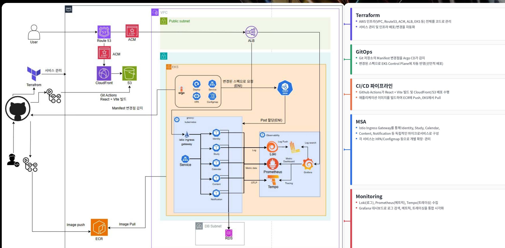

# Groovy — Cloud Native DevOps Project

> 학습 플랫폼 Groovy를 Docker 기반 환경에서 Kubernetes와 AWS 기반의 Cloud Native Architecture로 고도화한 팀 프로젝트입니다.

## Project Overview

Groovy는 스터디 생성, 콘텐츠 관리, 일정 관리, 알림 등의 기능을 제공하는 학습 플랫폼입니다.

프로젝트는 기본 프로젝트와 심화 프로젝트의 두 단계로 진행되었습니다.

기본 프로젝트에서는 Docker Compose 기반의 서비스 운영 환경을 구성하고 CI/CD, Monitoring, Load Testing을 적용하며 운영 환경에서 발생할 수 있는 문제를 재현하고 분석했습니다.

심화 프로젝트에서는 기존 환경을 기반으로 Kubernetes와 Helm을 도입하고, Monolithic Backend를 도메인 기준 MSA로 전환했습니다. 이후 AWS EKS와 RDS를 포함한 Cloud 환경으로 인프라를 확장하며 가용성, Database Architecture, Connection Capacity 등을 검증했습니다.

### Project Evolution

| Phase | Architecture | Focus |
| --- | --- | --- |
| **Foundation** | Docker Compose 기반 환경 | CI/CD · Monitoring · Load Testing · Troubleshooting |
| **Cloud Native Transformation** | Kubernetes · Helm · MSA · AWS | Container Orchestration · Database Architecture · High Availability · Capacity Testing |

```text
Docker Compose
      │
      ▼
Kubernetes
      │
      ▼
Helm
      │
      ▼
Domain-based MSA
      │
      ▼
AWS EKS / RDS
```

## Final Architecture



심화 프로젝트에서는 기존 Docker Compose 기반 환경을 Kubernetes와 AWS 기반의 Cloud Native 환경으로 확장했습니다.

애플리케이션은 Identity, Study, Content, Calendar, Notification의 도메인 단위 서비스로 분리하고, Kubernetes 환경에서 각 서비스를 독립적으로 배포할 수 있도록 구성했습니다.

AWS 환경에서는 EKS를 중심으로 애플리케이션을 운영하고, RDS를 Database 계층으로 구성했습니다. 또한 팀에서는 Terraform을 통한 AWS 인프라 관리와 GitOps 기반 배포 구조를 적용하여 인프라 구성부터 애플리케이션 배포까지의 운영 환경을 구축했습니다.

위 아키텍처는 **팀 전체가 함께 구축한 최종 서비스 구조**이며, 이후 내용은 해당 과정에서 제가 직접 담당한 영역과 문제 해결 경험을 중심으로 정리하였습니다.


## My Role & Contributions

프로젝트의 Cloud Native 전환 과정에서 Kubernetes/Helm 기반 배포 환경 구축과 MSA 전환 이후의 Database Infrastructure를 중심으로 구현 및 검증했습니다.

### 1. MySQL Connection Exhaustion 분석

기본 프로젝트에서 MySQL의 Connection 한계 상황을 재현하고, `max_connections` 도달로 신규 Connection이 거부되는 현상을 분석했습니다.

이 과정에서 애플리케이션뿐만 아니라 `mysqld-exporter` 역시 Database Connection을 확보하지 못해 Prometheus의 MySQL Metric 수집이 중단되는 2차 장애를 확인하고 원인을 분석했습니다.

### 2. Kubernetes & Helm Migration

Docker Compose 기반으로 운영하던 Groovy 서비스를 Kubernetes 환경으로 전환했습니다.

Kompose를 활용하여 초기 Kubernetes Resource를 구성하고 로컬 환경에서 동작을 검증한 뒤, 반복 가능한 배포와 환경별 설정 관리를 위해 Helm Chart 기반의 배포 구조로 전환했습니다.

### 3. MSA Database Architecture

Monolithic Backend가 Identity, Study, Content, Calendar, Notification의 도메인 기반 MSA로 분리됨에 따라 Database 구조 역시 서비스 단위로 재구성했습니다.

서비스별 Database 분리를 구현하고, AWS 이전 과정에서는 RDS 구성에 따른 비용과 운영 복잡도를 함께 검토하여 최종 Database Architecture를 구성했습니다.

### 4. RDS Multi-AZ & Failover

단일 RDS 구성에서 발생할 수 있는 가용성 문제를 보완하기 위해 RDS Multi-AZ 구성을 적용했습니다.

강제 Failover 테스트를 수행하여 Primary DB의 Availability Zone 전환을 확인하고, Failover 과정에서 Database Connection에 발생하는 영향과 복구 과정을 검증했습니다.

### 5. RDS Connection Capacity & HikariCP

MSA 환경에서 각 서비스가 실제로 요구하는 Database Connection 수를 확인하기 위해 서비스별 부하 테스트를 수행했습니다.

측정 결과를 바탕으로 RDS Instance Class와 Connection Capacity를 검토하고, 각 서비스의 HikariCP Pool 설정을 조정하여 제한된 Connection을 서비스별 수요에 맞게 배분했습니다.

## Engineering Journey

기본 프로젝트에서 경험한 Database Connection 문제는 심화 프로젝트에서 Database 구조와 가용성, Capacity를 직접 설계하고 검증하는 경험으로 이어졌습니다.

```text
MySQL Connection Exhaustion
        │
        ▼
Kubernetes & Helm Migration
        │
        ▼
MSA Database Architecture
        │
        ▼
RDS Multi-AZ & Failover
        │
        ▼
RDS Connection Capacity & HikariCP Tuning
```
기본 프로젝트에서는 Connection이 고갈되었을 때 시스템에 어떤 영향이 발생하는지를 분석했습니다.

심화 프로젝트에서는 여기서 한 단계 더 나아가 서비스가 실제로 요구하는 Connection은 얼마나 되는지, Database의 가용성과 Capacity를 어떻게 구성할 것인지를 부하 테스트와 장애 대응 테스트를 통해 검증했습니다.

## Documentation

### Infrastructure

- [Kubernetes & Helm Migration](./infrastructure/01_Kubernetes_Helm_Migration.md)

### Troubleshooting

- [MySQL Connection Exhaustion](./troubleshooting/01_MySQL_Connection_Exhaustion.md)

> Database Architecture, RDS Multi-AZ, Connection Capacity 관련 상세 문서는 심화 프로젝트 작업 기록을 기반으로 추가 정리합니다.
