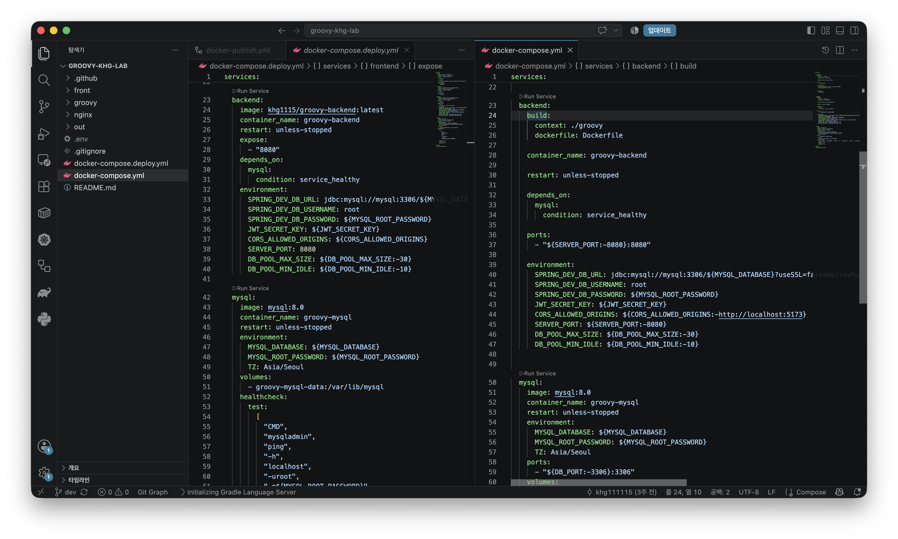
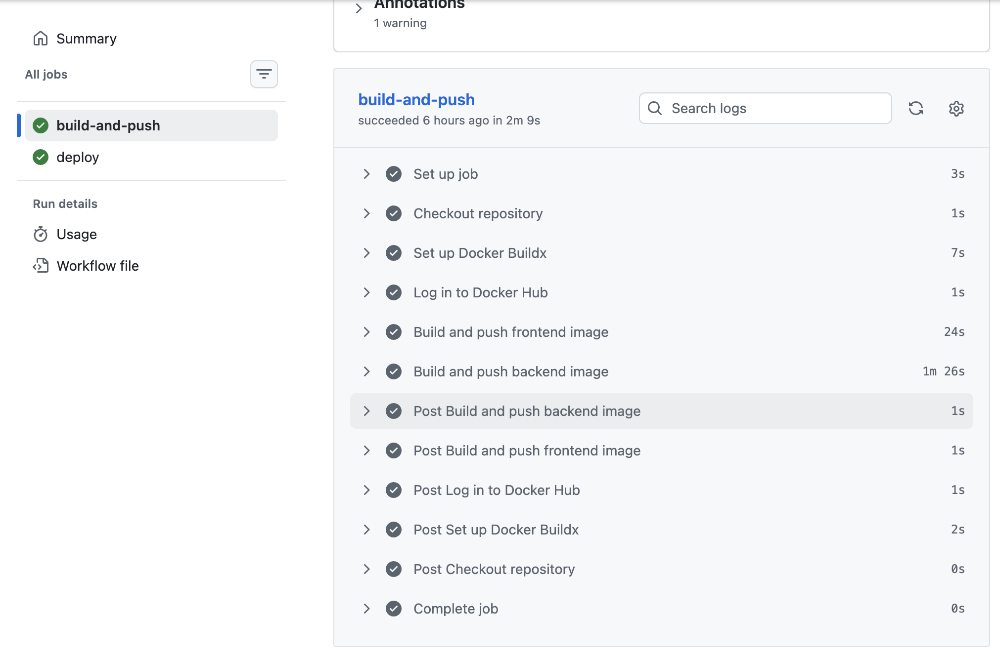
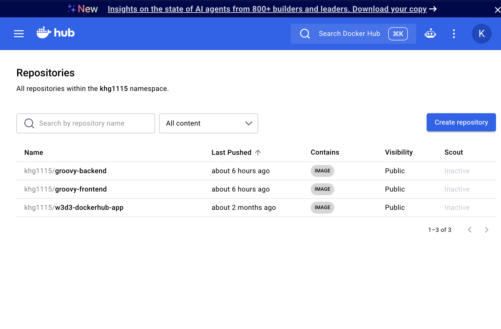
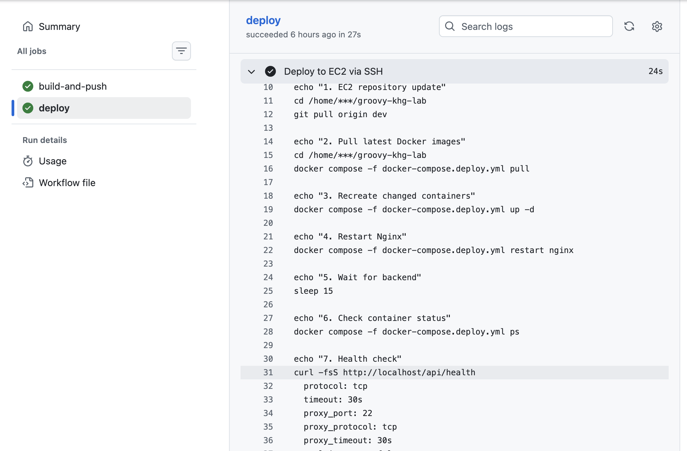
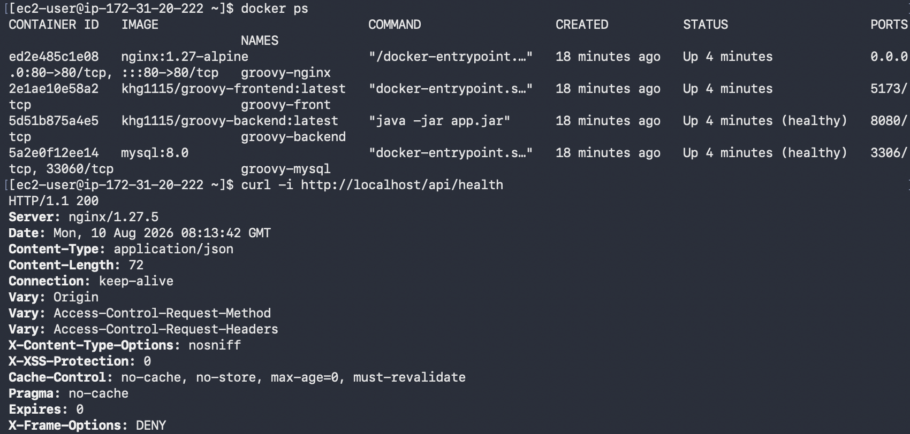
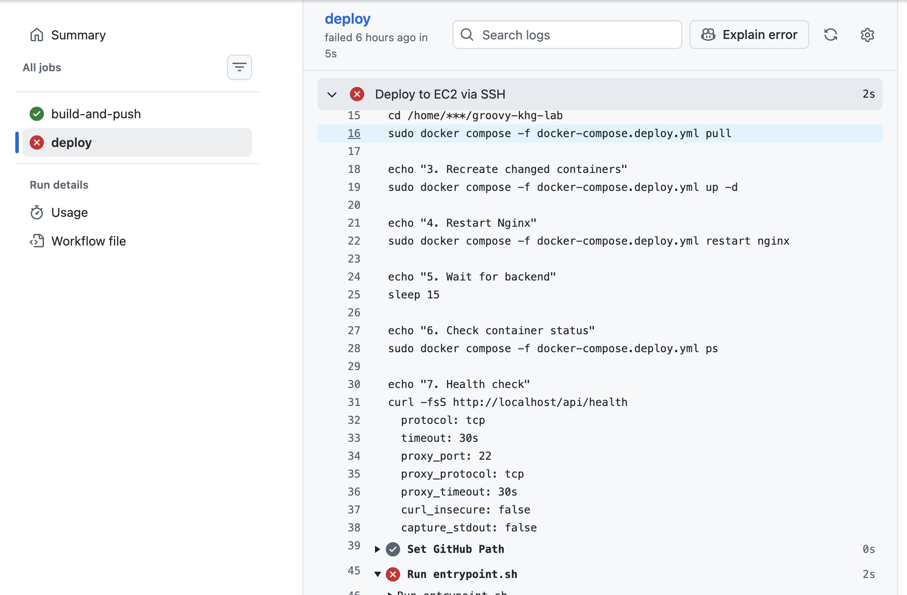

# GitHub Actions 기반 Docker 이미지 빌드 및 EC2 자동 배포

## 1. 개요

Groovy 프로젝트의 개인 실습 환경에서 GitHub Actions와 Docker Hub를 활용하여 CI/CD 파이프라인을 구성하였다.

기존의 수동 배포 방식에서는 코드 변경 시 Docker 이미지를 직접 빌드하고 배포 서버에서 컨테이너를 갱신해야 한다.

이를 개선하여 `dev` 브랜치에 코드가 Push되면 GitHub Actions가 자동으로 Docker 이미지를 빌드하여 Docker Hub에 Push하고, 이후 EC2에 SSH로 접속하여 최신 이미지를 Pull한 뒤 컨테이너를 재생성하도록 구성하였다.

최종적인 배포 흐름은 다음과 같다.

```text
Developer
    ↓
Git Push
    ↓
GitHub Repository
    ↓
GitHub Actions
    ├─ Frontend Image Build
    └─ Backend Image Build
    ↓
Docker Hub Push
    ↓
EC2 SSH 접속
    ↓
docker compose pull
    ↓
docker compose up -d
    ↓
Health Check
```

---

## 2. 로컬 환경과 배포 환경 분리

이전 Groovy 프로젝트의 모니터링 환경을 구성하는 과정에서 운영용 Compose 파일을 로컬에서 그대로 사용할 경우, Registry에 저장된 이미지를 Pull하여 실행하기 때문에 로컬에서 수정한 소스 코드가 반영되지 않는 문제를 경험하였다.

이를 통해 개발 환경과 배포 환경에서는 Docker Compose의 역할을 명확히 분리할 필요가 있다고 판단하였다.(Incident No.02 참고)

개발 환경에서는 현재 소스 코드를 기반으로 이미지를 빌드할 수 있도록 `docker-compose.yml`을 사용하였다.

반면 EC2 배포 환경에서는 서버 내부에서 애플리케이션을 다시 빌드하지 않고, CI 과정에서 생성되어 Docker Hub에 저장된 이미지를 Pull하여 실행하도록 `docker-compose.deploy.yml`을 별도로 구성하였다.

### Local

```yaml
backend:
  build:
    context: ./groovy
    dockerfile: Dockerfile
```

### Deploy

```yaml
backend:
  image: khg1115/groovy-backend:latest
```

즉, 두 Compose 파일의 역할을 다음과 같이 분리하였다.

```text
docker-compose.yml
→ 로컬 개발 환경에서 소스 기반 Image Build

docker-compose.deploy.yml
→ 배포 환경에서 Registry Image Pull 및 실행
```



이를 통해 개발 환경과 실제 배포 환경의 역할을 분리하고, EC2에서는 애플리케이션 빌드 작업 없이 배포에 필요한 이미지만 Pull하도록 구성하였다.

---

## 3. GitHub Actions를 통한 Docker 이미지 자동 Build & Push

CI 단계에서는 GitHub Actions를 이용하여 Frontend와 Backend Docker 이미지를 자동으로 빌드하여 Docker Hub에 Push하도록 구성하였다.

Workflow는 다음 과정을 수행한다.

```text
Checkout Repository
        ↓
Set up Docker Buildx
        ↓
Login to Docker Hub
        ↓
Build & Push Frontend Image
        ↓
Build & Push Backend Image
```

실제 GitHub Actions 실행 결과 Frontend와 Backend 이미지 모두 정상적으로 Build & Push가 완료되는 것을 확인하였다.



이 구조를 통해 개발자가 직접 Docker 이미지를 빌드하고 Push하는 과정을 자동화하였다.

---

## 4. Docker Hub 이미지 저장

GitHub Actions에서 빌드된 이미지는 Docker Hub에 저장하도록 구성하였다.

사용한 Repository는 다음과 같다.

```text
khg1115/groovy-frontend
khg1115/groovy-backend
```

GitHub Actions 실행 후 두 Repository의 `Last Pushed` 시간이 갱신되는 것을 확인하여 이미지가 정상적으로 Push되었음을 검증하였다.



이후 EC2에서는 애플리케이션 소스 코드를 직접 빌드하는 대신 해당 이미지를 Pull하여 사용한다.

---

## 5. EC2 자동 배포

Docker 이미지 Build & Push가 성공하면 다음 단계에서 GitHub Actions가 EC2에 SSH로 접속하여 자동 배포를 수행하도록 구성하였다.

주요 배포 과정은 다음과 같다.

```bash
git pull origin dev

docker compose -f docker-compose.deploy.yml pull

docker compose -f docker-compose.deploy.yml up -d

sleep 15

docker compose -f docker-compose.deploy.yml ps

curl -fsS http://localhost/api/health
```

각 명령의 역할은 다음과 같다.

```text
git pull
→ EC2 Repository 최신화

docker compose pull
→ Docker Hub에서 최신 이미지 다운로드

docker compose up -d
→ 변경된 이미지 기반으로 컨테이너 생성/갱신

sleep 15
→ Backend 애플리케이션 초기화 대기

docker compose ps
→ 컨테이너 실행 상태 확인

curl /api/health
→ Backend 서비스 정상 여부 확인
```

GitHub Actions의 Deploy Job이 성공하면서 위 과정 전체가 자동으로 수행되는 것을 확인하였다.



---

## 6. 배포 결과 검증

GitHub Actions 성공 여부만으로 배포가 완료되었다고 판단하지 않고 EC2에 직접 접속하여 컨테이너 상태와 Backend Health Check를 추가로 검증하였다.

```bash
docker ps
```

확인 결과 다음 컨테이너가 정상적으로 실행되고 있었다.

```text
groovy-nginx
groovy-front
groovy-backend
groovy-mysql
```

특히 Backend와 MySQL은 `healthy` 상태임을 확인하였다.

추가로 Nginx를 통해 Backend Health API를 호출하였다.

```bash
curl -i http://localhost/api/health
```

결과:

```text
HTTP/1.1 200
```

응답 결과 `HTTP/1.1 200`과 `Server: nginx/1.27.5`를 확인하였다.

이를 통해 Nginx가 요청을 정상적으로 수신하고 Backend의 Health API까지 요청이 전달되는 것을 확인하였다.



이를 통해 단순히 GitHub Actions Workflow가 성공한 것뿐만 아니라,

```text
Docker Image Build
→ Docker Hub Push
→ EC2 Image Pull
→ Container 실행
→ Nginx Proxy
→ Backend Health Check
```

까지 전체 배포 경로가 정상적으로 동작함을 검증하였다.

---

## 7. Troubleshooting - EC2 Docker Deploy 실패

### 문제 상황

초기 자동 배포 과정에서는 Docker 이미지 Build & Push 단계는 정상적으로 완료되었지만 EC2 Deploy 단계에서 실패하였다.

GitHub Actions는 EC2에 SSH 접속한 후 다음 명령을 실행하도록 구성되어 있었다.

```bash
sudo docker compose -f docker-compose.deploy.yml pull
```

하지만 Deploy Job에서 Docker 명령이 정상적으로 처리되지 않으면서 배포가 중단되었다.



### 원인 분석

실패한 Workflow에서는 Docker Compose 명령을 `sudo`를 통해 실행하고 있었다.

EC2에 직접 접속하여 확인한 결과, `ec2-user` 환경에서는 별도의 `sudo` 없이 `docker compose` 명령이 정상적으로 실행되고 있었다.

따라서 Workflow의 실행 환경을 EC2에서 정상 동작이 확인된 사용자 환경과 동일하게 맞추기 위해 `sudo`를 제거하였다.

`sudo` 제거 후 배포가 정상화된 것은 확인하였으나, 당시 실패 로그만으로 `sudo` 사용 자체를 배포 실패의 단일 근본 원인으로 확정하지는 않았다.

### 수정

기존:

```bash
sudo docker compose -f docker-compose.deploy.yml pull
sudo docker compose -f docker-compose.deploy.yml up -d
sudo docker compose -f docker-compose.deploy.yml restart nginx
sudo docker compose -f docker-compose.deploy.yml ps
```

수정:

```bash
docker compose -f docker-compose.deploy.yml pull
docker compose -f docker-compose.deploy.yml up -d
docker compose -f docker-compose.deploy.yml restart nginx
docker compose -f docker-compose.deploy.yml ps
```

수정 후 GitHub Actions를 다시 실행하였으며 Deploy Job이 정상적으로 완료되었다.

최종적으로 Workflow에서 다음과 같이 성공 상태를 확인하였다.

```text
build-and-push  → Success
deploy          → Success
```

이후 EC2에서도 컨테이너 상태 및 `/api/health`의 HTTP 200 응답을 확인하여 애플리케이션이 정상적으로 배포되었음을 재검증하였다.

---

## 8. 최종 구성

최종 CI/CD 구조는 다음과 같다.

```text
[Developer]
     │
     │ Git Push
     ▼
[GitHub Repository]
     │
     ▼
[GitHub Actions]
     │
     ├── Frontend Build
     ├── Backend Build
     │
     ▼
[Docker Hub]
     │
     │ Push / Pull
     ▼
[EC2]
     │
     ├── docker compose pull
     ├── docker compose up -d
     ├── container status check
     └── health check
```

이번 구성을 통해 코드 변경 이후 Docker 이미지 생성부터 EC2 컨테이너 갱신 및 Health Check까지 이어지는 자동 배포 흐름을 구현하였다.

기존의 수동 배포 과정을 자동화함으로써 반복적인 배포 작업을 줄였으며, 배포 마지막 단계에 Health Check를 포함하여 Workflow 성공 여부뿐만 아니라 실제 애플리케이션의 정상 동작까지 검증할 수 있도록 구성하였다.