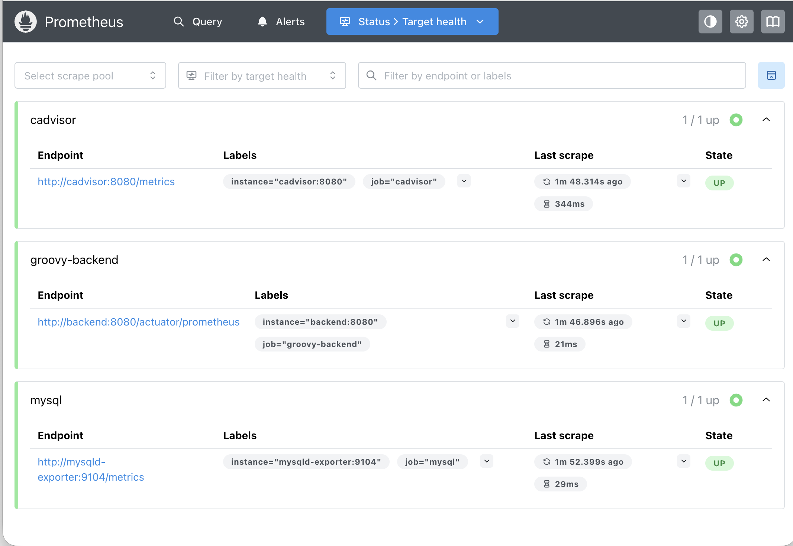
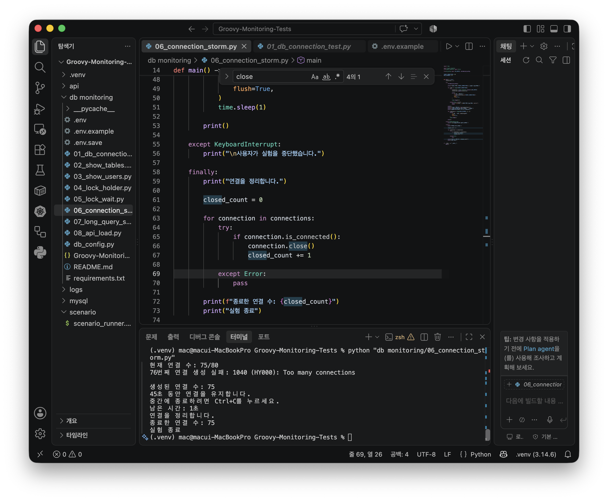
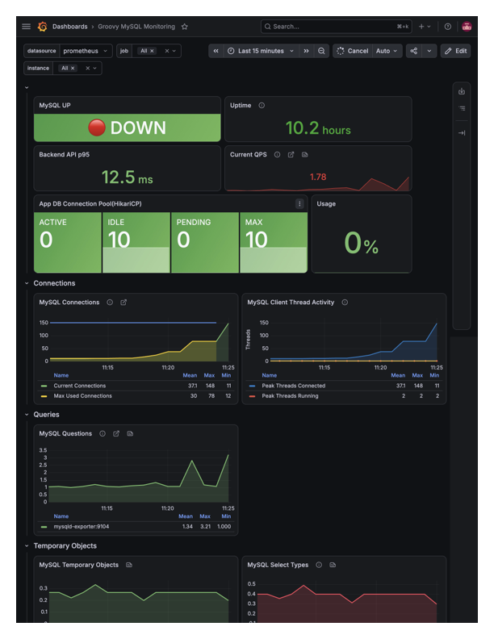

# MySQL Connection Exhaustion 장애 재현 및 분석

운영 환경에서 대량의 Connection을 발생시켜 MySQL의 `max_connections` 한계에 도달했을 때 시스템이 어떻게 동작하는지 확인하고, Monitoring 시스템(mysqld-exporter, Prometheus, Grafana)에 미치는 영향을 함께 분석한 트러블슈팅 사례입니다.

---

## Key Findings

- 운영 MySQL에서 Connection Exhaustion 재현
- `1040 (HY000): Too many connections` 오류 확인
- mysqld-exporter 메트릭 수집 실패 발생
- HikariCP Pool 고갈이 아닌 MySQL Connection Exhaustion이 원인임을 확인
- 운영 환경 대응 및 재발 방지 방안 도출

---

# 1. Background

운영 환경에서는 순간적인 트래픽 증가나 비정상적인 Connection 증가로 인해 MySQL의 Connection 한계에 도달할 수 있습니다.

이번 테스트에서는 운영 MySQL에 직접 Connection Storm을 발생시켜 장애 상황을 재현하고, 장애 발생 시 Monitoring 시스템이 어떻게 동작하는지 함께 분석하였습니다.

---

# 2. Test Environment

| Component | Description |
|-----------|-------------|
| Client | macOS |
| Connection | SSH Tunnel |
| Database | MySQL |
| Monitoring | Prometheus |
| Dashboard | Grafana |
| Exporter | mysqld-exporter |


테스트 시작 전 Prometheus Target 상태를 확인한 결과 Backend와 mysqld-exporter 모두 정상적으로 메트릭을 수집하고 있었습니다.


---

# 3. Test Scenario

Connection Storm 스크립트를 이용하여 Connection 수를 단계적으로 증가시키며 테스트를 수행하였습니다.

```
20 Connections

↓

40 Connections

↓

60 Connections

↓

80 Connections
```

80개의 Connection 생성을 시도한 결과

- 75개 생성 성공
- 76번째부터 신규 Connection 거부
- `1040 Too many connections` 발생

테스트 결과, 75개까지 Connection이 생성된 이후 76번째 Connection부터 MySQL의 Connection 한계에 도달하여 신규 연결이 거부되었습니다.



---

# 4. Unexpected Issue

Connection Exhaustion은 예상했던 결과였습니다.

하지만 테스트와 동시에 예상하지 못한 현상이 발생했습니다.

- Grafana에서 MySQL Monitoring Status가 **DOWN**으로 변경
- Prometheus에서 mysqld-exporter Target의 메트릭 수집 실패 확인

단순한 Connection Exhaustion이 아니라 Monitoring 시스템까지 영향을 받은 이유를 분석하기 시작했습니다.

---

# 5. Root Cause Analysis

## ① HikariCP Pool 고갈 여부 확인

먼저 애플리케이션의 Connection Pool(HikariCP)이 먼저 고갈된 것이 아닌지 확인했습니다.

Grafana에서 **Hikari Pending은 지속적으로 0**을 유지하였으며 Application Pool의 대기 현상은 발생하지 않았습니다.

---

## ② MySQL Connection 상태 확인

반면 Current Connections는 테스트가 진행될수록 지속적으로 증가하였고,

최종적으로

- `max_connections = 150`
- Current Connections = 150

에 도달하면서 신규 Connection 생성이 거부되었습니다.

이 과정에서 `1040 Too many connections` 오류가 발생했습니다.

Grafana에서도 MySQL Connection이 `max_connections` 한계까지 증가하는 것을 확인할 수 있었습니다.



---

## ③ mysqld-exporter 영향 분석

mysqld-exporter 역시 MySQL Connection을 사용하여 메트릭을 수집합니다.

Connection 생성이 거부되면서 exporter도 새로운 Connection을 생성하지 못했고,
실제 mysqld-exporter 로그에서도 MySQL 접속 시 `Error 1040: Too many connections`가 반복적으로 발생하는 것을 확인했습니다.


결과적으로

```
MySQL Connection Exhaustion

↓

mysqld-exporter Metric Collection Failure

↓

Prometheus mysqld-exporter Target DOWN

↓

Grafana Monitoring Data Loss
```

라는 연쇄 현상이 발생하였습니다.

이번 장애는

- **1차 장애:** MySQL Connection Exhaustion
- **2차 장애:** mysqld-exporter 메트릭 수집 실패

로 판단하였습니다.

---

# 6. Recovery

즉시 대응으로 MySQL Container를 재시작하여

- 기존 Connection 초기화
- Session 초기화

를 수행하였습니다.

재시작 이후

- Current Connections 정상화
- mysqld-exporter 정상 복구
- Prometheus 메트릭 수집 정상
- Grafana Dashboard 정상

을 확인하였습니다.

---

# 7. Prevention

이번 테스트를 통해 다음 개선 방향을 도출하였습니다.

### Immediate

- MySQL Container 재시작을 통한 장애 복구

### Short-term

- `max_connections` 등 Connection 관련 파라미터 검토
- Connection 사용량 70% 이상 Alert 구성

### Long-term

- DB 이중화(HA) 검토
- Failover 구조를 통한 서비스 연속성 확보

---

## Lessons Learned

- Application Connection Pool과 Database Connection 한계를 구분하여 분석해야 함을 확인하였다.

- Monitoring 시스템 역시 Database Connection에 의존하므로 장애 전파 가능성을 고려해야 한다.

- 장애 재현뿐 아니라 Root Cause 분석과 재발 방지 방안까지 포함해야 실제 운영 관점의 트러블슈팅이 된다.