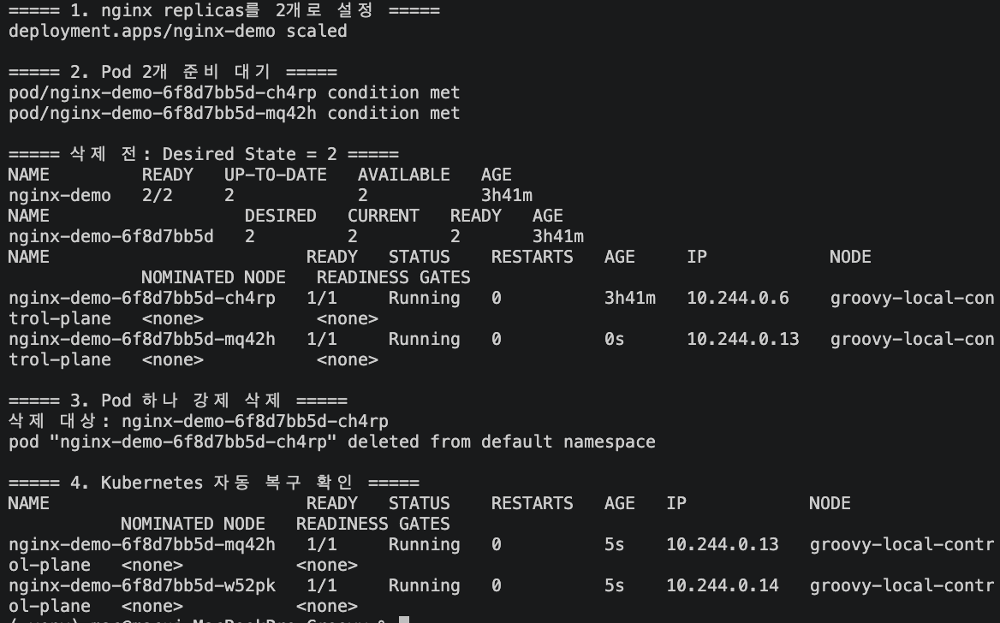
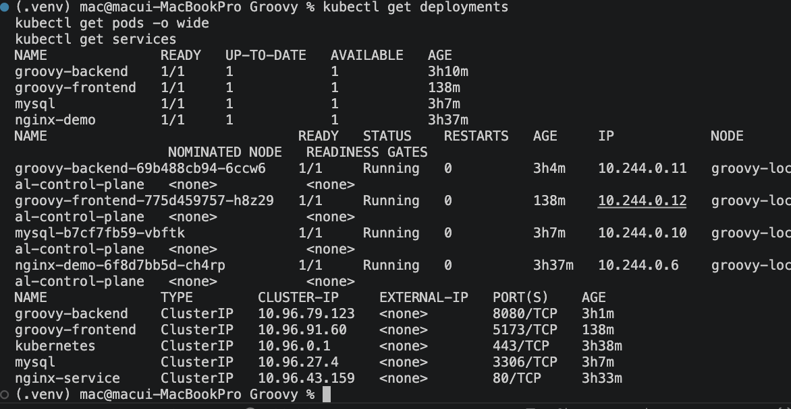
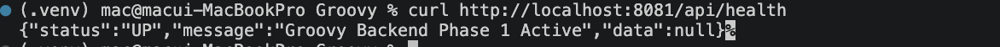
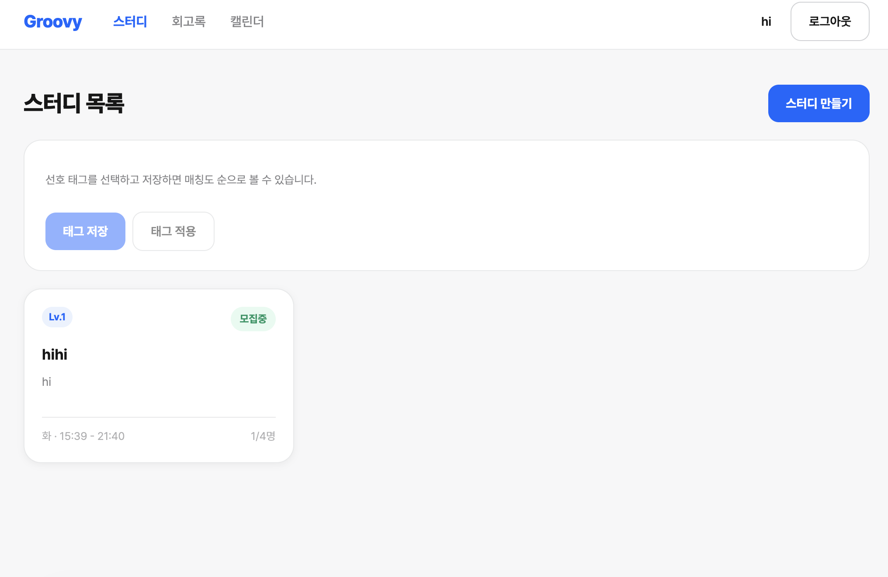

# Groovy 로컬 Kubernetes 전환 및 서비스 연동

## 1. 개요

기존 Groovy 프로젝트는 Docker Compose를 기반으로 Frontend, Backend, MySQL을 실행하고 있다.

Mini PC 환경에 Kubernetes를 적용하기에 앞서, 로컬 Mac 환경에서 `kind`를 이용해 Kubernetes 클러스터를 구성하고 기존 애플리케이션을 단계적으로 배포하였다.

이번 작업의 목표는 단순히 Pod를 실행하는 것이 아니라 다음 흐름을 실제 애플리케이션 수준에서 검증하는 것이었다.

```text
Browser
   ↓
Frontend
   ↓
Backend
   ↓
MySQL
```

최종적으로 Frontend, Backend, MySQL을 Kubernetes 환경에서 실행하고 실제 스터디 생성 기능을 통해 전체 서비스 연동을 검증하였다.

---

## 2. 테스트 환경

| 항목 | 환경 |
|---|---|
| Host | Mac (Apple Silicon) |
| Container Runtime | Docker Desktop |
| Kubernetes | kind |
| kind | v0.32.0 |
| kubectl | v1.36.2 |
| Kubernetes Node | kind Control Plane |
| Backend | Spring Boot / Java 21 |
| Frontend | React / Vite |
| Database | MySQL 8.0 |

로컬 Kubernetes 클러스터는 다음과 같이 생성하였다.

```bash
kind create cluster --name groovy-local
```

클러스터 생성 후 Node 및 Kubernetes 시스템 Pod의 정상 동작을 확인하였다.

---

## 3. Kubernetes 기본 동작 검증

실제 Groovy 서비스를 배포하기 전에 nginx Deployment를 이용하여 Kubernetes의 기본적인 리소스 관리와 Desired State 유지 동작을 확인하였다.

nginx Deployment의 replica를 2개로 설정하였다.

```bash
kubectl scale deployment nginx-demo --replicas=2
```

이후 실행 중인 Pod 하나를 강제로 삭제하였다.

```bash
kubectl delete pod <pod-name>
```

Pod이 삭제되자 ReplicaSet이 원하는 replica 수를 유지하기 위해 새로운 Pod을 자동으로 생성하였다.

```text
Deployment
    ↓
ReplicaSet
    ↓
Pod A
Pod B

Pod A 삭제
    ↓

ReplicaSet
"Desired = 2 / Current = 1"
    ↓

Pod C 생성
    ↓
Pod B
Pod C
```



이를 통해 Kubernetes가 삭제된 Pod 자체를 복구하는 것이 아니라, **선언된 Desired State와 현재 상태의 차이를 조정하여 새로운 Pod을 생성한다는 점**을 확인하였다.

또한 Pod의 IP와 이름은 재생성 과정에서 변경될 수 있기 때문에, 애플리케이션이 개별 Pod에 직접 의존하지 않도록 Service를 통한 접근이 필요함을 확인하였다.

---

## 4. Groovy 애플리케이션 Kubernetes 구성

기본 동작 검증 후 실제 Groovy 프로젝트의 Frontend, Backend, MySQL을 Kubernetes 환경에 배포하였다.

기존 Docker Compose 기반 구조를 다음과 같이 Deployment와 Service 구조로 전환하였다.

```text
Frontend Deployment
        ↓
Frontend Pod
        ↑
Frontend Service


Backend Deployment
        ↓
Backend Pod
        ↑
Backend Service


MySQL Deployment
        ↓
MySQL Pod
        ↑
MySQL Service
```

Backend와 Frontend는 기존 프로젝트에서 사용하던 Dockerfile을 활용하여 Kubernetes 테스트용 로컬 이미지를 생성하였다.

kind 클러스터는 Docker 컨테이너를 Kubernetes Node로 사용하기 때문에 Mac의 Docker 환경에 빌드된 이미지를 kind Node에 직접 로드하였다.

```bash
kind load docker-image groovy-backend:k8s-local --name groovy-local
kind load docker-image groovy-frontend:k8s-local --name groovy-local
```

배포 후 Deployment, Pod, Service 상태를 확인하였다.



Frontend, Backend, MySQL Pod가 모두 `Running` 상태로 동작하고 각 애플리케이션을 위한 ClusterIP Service가 생성된 것을 확인하였다.

---

## 5. Backend와 MySQL Service 연결

Backend는 기존 Docker Compose 환경에서 다음 주소를 통해 MySQL에 접근하도록 구성되어 있었다.

```text
jdbc:mysql://mysql:3306/...
```

Kubernetes에서도 동일하게 `mysql`이라는 이름의 Service를 생성하여 Backend가 개별 MySQL Pod의 IP가 아닌 **Kubernetes Service DNS**를 통해 데이터베이스에 접근하도록 구성하였다.

```text
Backend Pod
     │
     │ jdbc:mysql://mysql:3306
     ▼
mysql Service
     │
     │ selector
     ▼
MySQL Pod
```

초기 Backend 배포 시에는 Kubernetes 내부에 `mysql` Service가 존재하지 않아 Backend가 데이터베이스 호스트를 찾지 못했고 정상적으로 작동하지 않았다.

-> MySQL Deployment와 ClusterIP Service를 생성하였다.

Service는 label selector를 이용하여 MySQL Pod를 연결 대상으로 관리하므로, MySQL Pod이 재생성되어 이름이나 IP가 변경되더라도 Backend는 계속 다음 주소를 사용할 수 있다.

```text
mysql:3306
```

MySQL 구성 이후 Backend Pod이 새롭게 생성되면서 데이터베이스 연결이 정상적으로 이루어졌다.

Backend 정상 기동 후 다음과 같이 Health Check를 수행하였다.

```bash
curl http://localhost:8081/api/health
```



`status: UP` 응답을 통해 Kubernetes 환경에서 Backend가 정상적으로 실행되는 것을 확인하였다.

---

## 6. Frontend 배포 및 Backend API 연결

Frontend 역시 Deployment와 ClusterIP Service로 구성하였다.

Groovy Frontend는 Vite를 사용하고 있으며 `VITE_API_BASE_URL` 값이 빌드 시점에 JavaScript bundle에 포함되는 구조이다.

Backend → MySQL 통신의 경우 실제 요청 주체가 Kubernetes 내부의 Backend Pod이기 때문에 `mysql` Service DNS를 사용할 수 있다.

반면 Frontend의 Backend API 요청은 Frontend Pod 자체가 아니라 **사용자의 브라우저에서 실행되는 JavaScript가 전송한다.**

따라서 브라우저에서는 Kubernetes 내부 DNS인 다음 주소에 직접 접근할 수 없다.

```text
http://groovy-backend:8080
```

로컬 환경에서는 Backend Service를 Mac의 `localhost:8081`로 port-forward하였다.

```bash
kubectl port-forward service/groovy-backend 8081:8080
```

그리고 Frontend 이미지 빌드 시 브라우저에서 접근 가능한 Backend 주소를 전달하였다.

```bash
docker build \
  --build-arg VITE_API_BASE_URL=http://localhost:8081 \
  -t groovy-frontend:k8s-local \
  ./front
```

Frontend Service 역시 port-forward하여 브라우저에서 접근하였다.

```bash
kubectl port-forward service/groovy-frontend 5173:5173
```

로컬 검증 환경에서는 다음과 같은 흐름으로 서비스에 접근하였다.

```text
Browser
   │
   ├── localhost:5173
   │       ↓
   │   Frontend Service
   │       ↓
   │   Frontend Pod
   │
   └── API → localhost:8081
               ↓
           Backend Service
               ↓
           Backend Pod
```

---

## 7. Frontend → Backend → MySQL 통합 검증

최종적으로 다음 세 애플리케이션 Pod이 모두 정상적으로 실행되었다.

```text
groovy-frontend    Running
groovy-backend     Running
mysql              Running
```

전체 애플리케이션의 데이터 흐름은 다음과 같다.

```text
Browser
   │
   ▼
Frontend
   │
   │ API Request
   ▼
Backend
   │
   │ jdbc:mysql://mysql:3306
   ▼
mysql Service
   │
   ▼
MySQL
```

단순히 Pod의 `Running` 상태와 Backend Health Check만 확인하는 것으로 끝내지 않고 실제 Groovy 서비스에서 새로운 스터디를 생성하였다.



생성한 스터디가 정상적으로 조회되는 것을 확인하였다.

이를 통해 **Frontend → Backend → MySQL로 이어지는 실제 요청과 DB Write 흐름이 Kubernetes 환경에서 정상적으로 동작하는 것을 검증하였다.**

---

## 8. 확인된 한계: MySQL 데이터 영속성

현재 로컬 테스트의 MySQL은 별도의 Persistent Volume을 사용하지 않고 있다.

따라서 MySQL Pod 내부에 저장된 데이터의 생명주기가 Pod와 분리되어 있지 않다.

```text
현재 구조

MySQL Pod
    ↓
DB Data
```

MySQL Pod이 삭제될 경우 Deployment와 ReplicaSet에 의해 새로운 MySQL Pod는 생성될 수 있다.

하지만 새롭게 생성된 Pod는 기존 Pod 자체를 복구한 것이 아니므로 기존 Pod 내부에 저장되어 있던 데이터까지 자동으로 복구되지는 않는다.

```text
MySQL Pod A
    ↓
DB Data

Pod A 삭제
    ↓

MySQL Pod B 생성
    ↓
기존 데이터 유지 불가
```

Docker Compose 환경에서는 Docker Volume을 통해 컨테이너와 데이터의 생명주기를 분리하였다.

Kubernetes 환경에서도 동일한 데이터 영속성 문제를 해결하기 위해 다음 단계에서 PVC(PersistentVolumeClaim)를 적용할 예정이다.

```text
MySQL Pod
    ↓
   PVC
    ↓
Persistent Storage
```

이를 통해 MySQL Pod가 삭제되고 새로운 Pod이 생성되더라도 동일한 Persistent Storage를 사용하도록 구성하고, 기존 데이터가 유지되는지 검증할 예정이다.

---

## 9. 향후 계획

이번 로컬 실습 이후 다음 단계에서는 Mini PC 환경에 Kubernetes 구성을 적용하고 데이터 영속성과 외부 접근 구조를 추가로 개선할 예정이다.

- Mini PC kind 환경으로 Kubernetes 구성 이전
- MySQL PVC 적용 및 데이터 영속성 검증
- MySQL과 같은 Stateful Workload의 StatefulSet 적용 검토
- Pod 재생성 상황에서 서비스 연속성 검증
- Frontend 외부 접근 구조 개선
- Ingress 또는 Reverse Proxy 기반 외부 진입점 구성 검토
- 향후 AWS 환경 전환 시 EKS 및 RDS 기반 구조 검토

---

## 10. 결과

Docker Compose 기반으로 실행하던 Groovy의 Frontend, Backend, MySQL을 로컬 kind 환경에서 Kubernetes Deployment와 Service 구조로 구성하였다.

nginx를 이용한 사전 실습을 통해 Deployment, ReplicaSet, Pod의 Desired State 유지 동작을 확인하였으며, 실제 Groovy 애플리케이션에서는 Service를 이용해 각 Pod에 안정적인 접근 경로를 제공하였다.

특히 Kubernetes Service DNS를 통한 Backend ↔ MySQL 연결을 구성하고, Frontend와 Backend를 연동한 뒤 실제 스터디 생성 기능까지 수행하였다.

이를 통해 단순한 Kubernetes 리소스 생성에서 끝나는 것이 아니라 **Frontend → Backend → MySQL로 이어지는 실제 애플리케이션의 전체 요청 흐름이 Kubernetes 환경에서도 정상적으로 동작하는 것을 확인하였다.**

또한 MySQL Pod 재생성 시 데이터 영속성 문제가 발생할 수 있음을 확인하였으며, 다음 단계에서는 PVC를 적용하여 Pod의 생명주기와 데이터 저장소를 분리하는 방향으로 개선할 예정이다.
