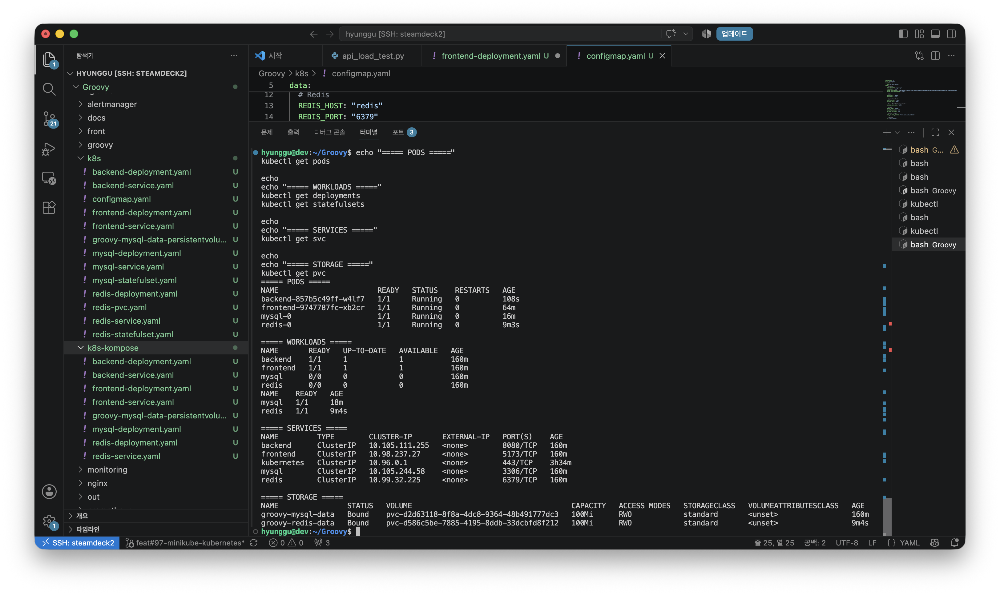
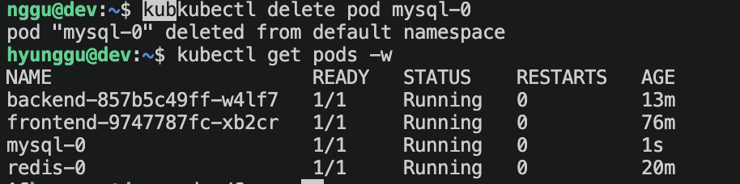

# Groovy Kubernetes & Helm Migration

## 1. Overview

Groovy 프로젝트는 초기 Docker Compose 환경에서 Frontend, Backend, MySQL, Redis를 컨테이너로 실행하고 있었습니다.

프로젝트의 배포 환경을 Kubernetes 기반으로 전환하기 위해 로컬 `kind` 환경에서 실제 애플리케이션의 동작을 먼저 검증한 뒤, Mini PC의 Minikube 환경으로 이전하여 Kubernetes Resource 구조를 재설계했습니다.

이후 반복되는 Kubernetes 설정을 Helm Chart로 전환하고, 새로운 Minikube 환경에서도 동일한 애플리케이션을 재현할 수 있는 배포 구조를 구성했습니다.

전체 Migration은 다음과 같이 진행했습니다.

~~~text
Docker Compose
      ↓
Local kind에서 Kubernetes 동작 검증
      ↓
Kompose를 활용한 Manifest 초안 생성
      ↓
서비스 특성에 맞게 Kubernetes Resource 재설계
      ↓
Mini PC / Minikube 환경 배포
      ↓
전체 서비스 연동 및 데이터 영속성 검증
      ↓
Raw Kubernetes YAML → Helm Chart 전환
      ↓
새로운 Minikube 환경에서 배포 재현 검증
~~~

단순히 컨테이너 실행 환경을 변경하는 데 그치지 않고, 각 Workload의 특성에 따라 Deployment와 StatefulSet을 구분하고 Service, PVC, ConfigMap, Secret을 구성했습니다.

또한 실제 서비스 기능과 Pod 재생성 시 데이터 영속성을 검증한 뒤, Helm Chart와 외부 Container Registry를 이용하여 새로운 Kubernetes 환경에서도 Groovy 서비스를 재현할 수 있는지 확인했습니다.

---

## 2. Migration Background

### Docker Compose 기반 초기 구조

초기 Groovy 애플리케이션은 Docker Compose를 이용하여 다음 서비스를 실행했습니다.

~~~text
Docker Compose
├── Frontend
├── Backend
├── MySQL
└── Redis
~~~

Docker Compose 환경에서는 하나의 Compose 설정을 기반으로 각 Container를 실행하고 서비스 간 통신을 구성할 수 있었습니다.

프로젝트가 Kubernetes 환경으로 전환되면서 기존 Container 구성을 Kubernetes Resource 구조로 다시 설계할 필요가 있었습니다.

### 단계적 Migration 전략

Docker Compose 구성을 바로 최종 Kubernetes 환경으로 전환하지 않고, 먼저 로컬 Mac의 `kind` 클러스터에서 Frontend → Backend → MySQL로 이어지는 실제 요청 흐름을 검증했습니다.

이후 Mini PC의 Minikube 환경으로 이전하면서 `Kompose`를 활용해 기존 Docker Compose 구성을 Kubernetes Manifest의 초안으로 변환했습니다.

~~~text
Docker Compose
      ↓
Local kind 검증
      ↓
Mini PC / Minikube
      ↓
Raw Kubernetes
      ↓
Helm Chart
      ↓
새로운 Minikube 환경에서 재현 검증
~~~

각 단계에서 실제 애플리케이션의 정상 동작을 확인한 뒤 다음 단계로 확장했으며, 세부적인 Kubernetes Resource 설계와 Kompose 변환 결과의 수정 과정은 다음 절에서 다룹니다.

---

## 3. Docker Compose → Kubernetes Resource 재설계

### Kompose를 활용한 Manifest 초안 생성

기존 Docker Compose 설정을 Kubernetes Manifest로 전환하기 위한 첫 단계로 `Kompose`를 사용했습니다.

~~~bash
kompose convert
~~~

Kompose를 통해 기존 Compose 설정을 Kubernetes Resource 형태의 YAML로 변환할 수 있었지만, 자동 생성된 Manifest를 그대로 최종 구성으로 사용하지는 않았습니다.

애플리케이션별 상태 관리와 데이터 영속성 요구사항을 검토한 뒤, 생성된 Manifest를 기준으로 Kubernetes Resource를 직접 재설계했습니다.

| 대상 | 최종 구성 | 설계 기준 |
|---|---|---|
| Frontend | Deployment + Service | Stateless 애플리케이션 |
| Backend | Deployment + Service | Stateless 애플리케이션 |
| MySQL | StatefulSet + Service + PVC | DB 데이터 영속성 필요 |
| Redis | StatefulSet + Service + PVC | 상태 및 저장공간 관리 필요 |
| 일반 환경설정 | ConfigMap | 애플리케이션 설정 분리 |
| 민감정보 | Secret | Password, JWT 등의 민감정보 분리 |

### Stateless / Stateful Workload 분리

Frontend와 Backend는 애플리케이션 자체에 상태를 저장하지 않는 Stateless Workload로 판단하여 `Deployment`로 구성했습니다.

반면 MySQL과 Redis는 데이터와 상태를 다루기 때문에 `StatefulSet`으로 구성하고 각각 Persistent Storage를 연결했습니다.

실제 Minikube 환경에서 Frontend, Backend, MySQL, Redis가 정상적으로 실행되는 것을 확인했으며, MySQL과 Redis에 연결된 PVC가 `Bound` 상태로 생성된 것도 함께 확인했습니다.

~~~text
Deployment
├── Frontend Pod
└── Backend Pod

StatefulSet
├── mysql-0
│   └── PVC
└── redis-0
    └── PVC
~~~

StatefulSet을 적용하는 것만으로 데이터가 보존되는 것은 아니기 때문에 MySQL과 Redis에 각각 PVC를 구성했습니다.

Mini PC의 Minikube 환경에서는 `standard` StorageClass를 사용하여 PV를 직접 생성하지 않고 Dynamic Provisioning 방식으로 Persistent Volume을 할당했습니다.

~~~text
mysql-0
   │
   │ /var/lib/mysql
   ▼
groovy-mysql-data PVC
   │
   ▼
StorageClass (standard)
   │
   ▼
PV
~~~

배포 후 MySQL과 Redis PVC가 모두 `Bound` 상태인 것을 확인했습니다.

### ConfigMap / Secret 분리

기존 애플리케이션의 환경변수도 성격에 따라 `ConfigMap`과 `Secret`으로 분리했습니다.

`ConfigMap`에는 Database 연결 정보, Redis Host/Port, DB Pool, CORS, Timezone 등의 일반 설정을 구성하고, `Secret`에는 MySQL Password와 JWT Secret Key 등의 민감정보를 분리했습니다.

각 Workload에서는 다음과 같이 설정을 주입하도록 구성했습니다.

~~~yaml
envFrom:
  - configMapRef:
      name: groovy-config
  - secretRef:
      name: groovy-secret
~~~

실제 Secret 값은 Git Repository에 포함하지 않고 Kubernetes Cluster에 별도로 생성하여 관리했습니다.

이를 통해 Docker Compose의 Container 중심 구성을 Kubernetes의 Workload, Network, Storage, Configuration Resource로 분리했습니다.

---
## 4. Service Connectivity & End-to-End Validation

### Service를 통한 내부 통신

Kubernetes 환경에서는 Pod가 재생성될 경우 IP가 변경될 수 있으므로 애플리케이션이 특정 Pod IP를 직접 참조하지 않도록 각 Workload 앞에 `Service`를 구성했습니다.

Backend의 MySQL 접근 구조는 다음과 같이 구성했습니다.

~~~text
Backend Pod
     │
     │ jdbc:mysql://mysql:3306/...
     ▼
MySQL Service
name: mysql
port: 3306
     │
     │ selector
     ▼
mysql-0 Pod
     │
     ▼
MySQL Container :3306
~~~

Kubernetes 내부 DNS를 통해 Service 이름인 `mysql`을 사용할 수 있으므로 MySQL Pod가 재생성되어 IP가 변경되더라도 Backend에서는 동일하게 `mysql:3306`으로 접근할 수 있습니다.

초기 로컬 검증 과정에서는 Kubernetes 내부에 `mysql` Service가 존재하지 않아 Backend가 Database Host를 찾지 못하는 문제가 발생했습니다.

MySQL Workload와 ClusterIP Service를 구성한 뒤 Backend의 Database 연결이 정상적으로 이루어졌으며 Health Check를 통해 애플리케이션의 정상 기동을 확인했습니다.

### Frontend와 Backend 접근 구조

Backend → MySQL 통신은 Kubernetes Cluster 내부에서 발생하므로 Service DNS를 사용할 수 있습니다.

반면 Groovy Frontend는 Vite 기반이며 Backend API 요청은 Frontend Pod가 아니라 사용자의 브라우저에서 실행되는 JavaScript가 전송합니다.

따라서 브라우저에서는 Kubernetes 내부 DNS인 Backend Service 이름으로 직접 접근할 수 없습니다.

로컬 및 Mini PC 검증 단계에서는 `port-forward`를 이용하여 Frontend와 Backend에 접근 가능한 경로를 구성했습니다.

~~~text
Browser
   │
   ├── Frontend
   │      ↓
   │   Frontend Service
   │      ↓
   │   Frontend Pod
   │
   └── API Request
          ↓
       Backend Service
          ↓
       Backend Pod
          ├──→ MySQL Service
          └──→ Redis Service
~~~

Mini PC에서는 Mac Browser와 Mini PC 사이에 SSH Tunnel을 구성하고, Mini PC 내부에서 Kubernetes Service로 `port-forward`하여 실제 애플리케이션에 접근했습니다.

이 구성은 외부 노출을 위한 최종 네트워크 구조가 아니라 Kubernetes 전환 과정에서 애플리케이션의 정상 동작을 검증하기 위한 접근 방식으로 사용했습니다.

### 실제 서비스 기능 검증

Kubernetes Resource가 생성되고 Pod가 `Running` 상태인 것만으로 Migration 성공 여부를 판단하지 않았습니다.

Frontend부터 Backend, MySQL, Redis까지 실제 애플리케이션 흐름이 정상적으로 동작하는지 확인했습니다.

~~~text
Frontend 화면 렌더링        ✅
Backend /api/health         ✅
로그인 / 인증                ✅
스터디 생성 및 조회           ✅
MySQL 연결                   ✅
Redis PING → PONG           ✅
MySQL PVC Bound             ✅
Redis PVC Bound             ✅
~~~

특히 실제 Groovy 서비스에서 새로운 Study를 생성한 뒤 정상적으로 조회되는 것을 확인했습니다.

이를 통해 단순한 Kubernetes Resource 배포를 넘어 다음 전체 요청 흐름과 Database Write가 정상적으로 동작하는 것을 검증했습니다.

~~~text
Frontend
   ↓
Backend
   ├──→ MySQL
   └──→ Redis
~~~

---
## 5. StatefulSet Self-healing & Data Persistence Validation

MySQL을 StatefulSet과 PVC로 구성한 뒤, Pod가 재생성되는 상황에서도 애플리케이션 데이터가 유지되는지 직접 검증했습니다.

### 검증 시나리오

먼저 Groovy 애플리케이션에서 테스트용 Study 데이터를 생성한 뒤 MySQL Pod인 `mysql-0`을 강제로 삭제했습니다.

~~~bash
kubectl delete pod mysql-0
~~~

Pod 삭제 직후 StatefulSet Controller는 선언된 `replicas: 1`과 현재 상태의 차이를 감지하고, Desired State를 복구하기 위해 새로운 `mysql-0` Pod가 생성되도록 조정했습니다.

실제 검증에서도 `mysql-0`을 강제로 삭제한 직후 새로운 `mysql-0` Pod가 생성되어 `Running` 상태로 전환되는 것을 확인했습니다.

~~~text
Study 데이터 생성
      ↓
mysql-0 강제 삭제
      ↓
실제 Pod 수 = 0
Desired replicas = 1
      ↓
StatefulSet Controller
      ↓
새로운 mysql-0 생성
      ↓
기존 PVC 재연결
      ↓
Study 데이터 재조회
~~~

### 검증 결과

새로운 `mysql-0` Pod가 `Running` 상태로 전환된 뒤 애플리케이션에서 삭제 전 생성했던 Study 데이터를 다시 조회했습니다.

기존 데이터가 그대로 유지되는 것을 확인하여 다음 두 가지 동작을 검증했습니다.

**1. StatefulSet에 의한 Pod 상태 복구**

Pod가 삭제되더라도 StatefulSet이 선언된 replica 수를 기준으로 새로운 Pod를 생성하여 원하는 상태를 복구했습니다.

**2. PVC를 통한 데이터 영속성**

새로 생성된 Pod가 기존 PVC를 다시 연결하면서 Pod와 Container의 생명주기와 관계없이 MySQL 데이터가 유지되었습니다.

~~~text
MySQL Pod
    ↓
삭제 및 재생성
    ↓
기존 PVC 재연결
    ↓
Persistent Storage
    ↓
기존 데이터 유지
~~~

이를 통해 StatefulSet의 Pod 재생성과 PVC의 데이터 영속성이 서로 다른 역할을 수행한다는 점을 실제 애플리케이션 데이터로 검증했습니다.

추가로 Helm 기반 재현 환경에서는 Pod만 삭제한 경우 기존 PVC와 데이터가 유지되는 반면, Namespace와 PVC까지 제거하면 저장된 데이터도 함께 삭제되는 것을 확인했습니다.

---

## 6. Raw Kubernetes → Helm Migration

Raw Kubernetes Manifest 기반으로 전체 서비스의 실행과 연동을 검증한 뒤, 반복되는 Kubernetes 설정을 일관되게 관리하고 새로운 환경에서도 배포를 재현할 수 있도록 Helm Chart로 전환했습니다.

### Helm Chart 기반 배포 구조

기존에는 Kubernetes Resource별 YAML을 직접 관리하고 적용했습니다.

~~~text
Raw Kubernetes YAML
├── Frontend Deployment / Service
├── Backend Deployment / Service
├── MySQL StatefulSet / Service / PVC
├── Redis StatefulSet / Service / PVC
├── ConfigMap
└── Secret
~~~

Helm 전환 이후에는 Kubernetes Resource를 Chart로 관리하고, 환경에 따라 변경되는 값을 분리하여 배포 시 주입할 수 있도록 구성했습니다.

~~~text
Helm Chart
      │
      ├── Kubernetes Resource Templates
      │
      ├── values.yaml
      │
      └── values-secret.yaml
      │
      ↓
helm install
      ↓
Groovy Kubernetes Resources
~~~

### Secret 분리

실제 Password와 JWT Secret 등의 민감정보가 Git Repository에 포함되지 않도록 Secret 값을 별도의 Values 파일로 분리했습니다.

Repository에는 실제 값을 제외한 Example 파일만 관리하고, 배포 환경에서는 이를 복사하여 실제 값을 입력하도록 구성했습니다.

~~~text
values-secret.example.yaml   → Git 관리
values-secret.yaml           → 실제 Secret 값 / Git 제외
~~~

실제 Secret 파일이 Git에서 제외되는지도 다음 명령으로 확인했습니다.

~~~bash
git check-ignore -v helm/groovy/values-secret.yaml
~~~

이를 통해 Helm Chart 자체는 Repository에서 공유하면서 실제 Secret 값은 Git에서 제외한 `values-secret.yaml`에 작성하고, Helm 배포 시 별도의 Values 파일로 전달하도록 구성했습니다.

### Chart 사전 검증

Cluster에 설치하기 전에 `helm lint`를 이용하여 Chart의 기본적인 문법과 구성을 검증했습니다.

~~~bash
helm lint helm/groovy \
  -f helm/groovy/values-secret.yaml
~~~

검증 결과:

~~~text
1 chart(s) linted, 0 chart(s) failed
~~~

또한 `helm template`을 이용하여 실제 Kubernetes Manifest가 정상적으로 렌더링되는지 확인했습니다.

~~~bash
helm template groovy helm/groovy \
  -f helm/groovy/values-secret.yaml \
  > /tmp/groovy-rendered.yaml
~~~

이 과정을 통해 실제 Cluster에 Resource를 생성하기 전에 Helm Chart의 렌더링 결과를 확인했습니다.

### Helm을 통한 전체 서비스 배포

검증한 Chart를 새로운 테스트 Namespace에 설치했습니다.

~~~bash
helm install groovy helm/groovy \
  -n groovy-helm-test \
  -f helm/groovy/values-secret.yaml
~~~

설치 후 Helm Release가 `deployed` 상태인 것을 확인하고 Kubernetes Resource의 상태를 검증했습니다.

~~~text
Frontend Pod       1/1 Running
Backend Pod        1/1 Running
MySQL Pod          1/1 Running
Redis Pod          1/1 Running

Frontend Deployment   1/1
Backend Deployment    1/1

MySQL StatefulSet     1/1
Redis StatefulSet     1/1

MySQL PVC             Bound
Redis PVC             Bound
~~~

이를 통해 기존 Raw Kubernetes 환경에서 구성했던 Deployment, StatefulSet, Service, PVC 및 설정 구조를 Helm Chart 기반으로 다시 배포할 수 있음을 확인했습니다.

---

## 7. Deployment Reproducibility Validation

Helm 전환의 최종 목표는 기존 Cluster에서 애플리케이션이 동작하는 것뿐만 아니라, 새로운 Kubernetes 환경에서도 동일한 배포 구성을 재현할 수 있는지 확인하는 것이었습니다.

### 새로운 Minikube 환경에서 재배포

새로운 Minikube 환경에서는 로컬에 미리 빌드된 애플리케이션 이미지에 의존하지 않도록 Frontend와 Backend 이미지를 Public Container Registry에서 Pull하도록 구성했습니다.

~~~text
GitHub Repository
└── Helm Chart
        │
        ├── Kubernetes Templates
        └── Values
              +
Public Container Registry
├── Frontend Image
└── Backend Image
              +
Local Secret Values
        │
        ▼
New Minikube Cluster
        │
        ▼
Groovy Application
~~~

배포에 필요한 구성요소를 다음과 같이 분리했습니다.

| 구성요소 | 역할 |
|---|---|
| GitHub Repository | Helm Chart 및 배포 설정 관리 |
| Public Container Registry | Frontend / Backend Image 제공 |
| `values-secret.yaml` | 환경별 민감정보 주입 |
| Helm | Kubernetes Resource 렌더링 및 배포 |

이 구조를 이용하여 팀원 또는 새로운 로컬 환경에서도 Repository의 Helm Chart와 Container Image, 환경별 Secret 값만 준비하면 Groovy 애플리케이션을 배포할 수 있도록 구성했습니다.

### 배포 후 애플리케이션 검증

Helm 설치 후 단순히 Resource 상태만 확인하지 않고 Frontend와 Backend에 실제로 접근하여 애플리케이션 기능을 다시 검증했습니다.

~~~text
Helm Release             deployed
Frontend Pod             Running
Backend Pod              Running
MySQL Pod                Running
Redis Pod                Running
MySQL / Redis PVC        Bound

Backend Health Check     HTTP 200
Frontend Rendering       정상
회원가입 / 로그인          정상
스터디 목록 및 기능         정상
~~~

이를 통해 Raw Kubernetes 환경에서 검증했던 애플리케이션 동작을 Helm 기반의 새로운 Minikube 환경에서도 재현할 수 있음을 확인했습니다.

### Validation Result

최종적으로 다음 구성만을 이용하여 새로운 Minikube 환경에서 Groovy 서비스를 재현했습니다.

> **GitHub의 Helm Chart + Public Container Registry Image + Local Secret Values → Groovy 서비스 배포 및 기능 검증 성공**

Docker Compose에서 시작한 배포 구조를 Kubernetes Resource로 재설계하고, 실제 서비스와 데이터 영속성을 검증한 뒤 Helm Chart로 패키징함으로써 특정 로컬 환경에 종속된 배포 방식에서 반복 가능한 Kubernetes 배포 구조로 전환했습니다.

---

## 8. Result & Lessons Learned

### Result

Docker Compose 기반 Groovy 애플리케이션을 Kubernetes Resource로 재설계하고, Raw Kubernetes 환경에서의 검증을 거쳐 Helm Chart 기반의 배포 구조로 전환했습니다.

전환 과정에서는 다음 세 가지를 중심으로 실제 동작을 검증했습니다.

- Frontend → Backend → MySQL / Redis로 이어지는 End-to-End 서비스 연동
- MySQL Pod 재생성 시 StatefulSet의 상태 복구와 PVC를 통한 데이터 영속성
- Helm Chart, Container Image, 환경별 Secret 값을 이용한 새로운 Minikube 환경에서의 배포 재현

최종적으로 단일 환경에서 동작하는 Kubernetes 구성을 만드는 데 그치지 않고, 새로운 Kubernetes 환경에서도 동일한 애플리케이션 배포와 기능 검증을 반복할 수 있는 구조를 구성했습니다.

### Lessons Learned

**1. 자동 변환 도구는 Migration의 출발점으로 활용했습니다.**

Kompose를 이용하면 Docker Compose 설정을 빠르게 Kubernetes Manifest 형태로 변환할 수 있지만, 자동 생성 결과만으로 애플리케이션의 상태 관리와 데이터 영속성 요구사항까지 결정할 수는 없었습니다.

따라서 자동 변환 결과를 초안으로 활용하고 각 Workload의 특성을 기준으로 Deployment, StatefulSet, Service, PVC 등의 Resource를 직접 재설계하는 과정이 필요했습니다.

**2. Resource가 Running인 것과 서비스가 정상 동작하는 것은 별개의 검증 대상이었습니다.**

Pod와 Service의 상태 확인에서 끝내지 않고 실제 로그인, 인증, Study 생성 및 조회, MySQL 연결, Redis 통신까지 확인했습니다.

이를 통해 Infrastructure Migration에서는 Resource 상태뿐만 아니라 실제 애플리케이션의 End-to-End 흐름까지 검증해야 한다는 점을 확인했습니다.

**3. Stateful Workload에서는 Pod 복구와 데이터 영속성을 분리해서 확인해야 했습니다.**

MySQL Pod를 직접 삭제하여 StatefulSet이 원하는 상태를 복구하는 과정과 기존 PVC가 다시 연결되어 데이터가 유지되는 과정을 각각 검증했습니다.

이를 통해 Workload의 복구와 Persistent Data의 생명주기를 별도의 관점에서 설계하고 검증해야 한다는 점을 확인했습니다.

**4. Helm 전환의 목적을 단순한 YAML 템플릿화가 아닌 배포 재현성에 두었습니다.**

Raw Kubernetes 환경에서 검증한 구성을 Helm Chart로 전환하고, Chart와 Container Image, 환경별 Secret 값만으로 새로운 Minikube 환경에서 전체 서비스를 다시 배포했습니다.

이를 통해 특정 Cluster에서 한 번 동작하는 구성이 아니라 다른 환경에서도 동일한 배포 과정을 반복할 수 있는 구조로 발전시켰습니다.
