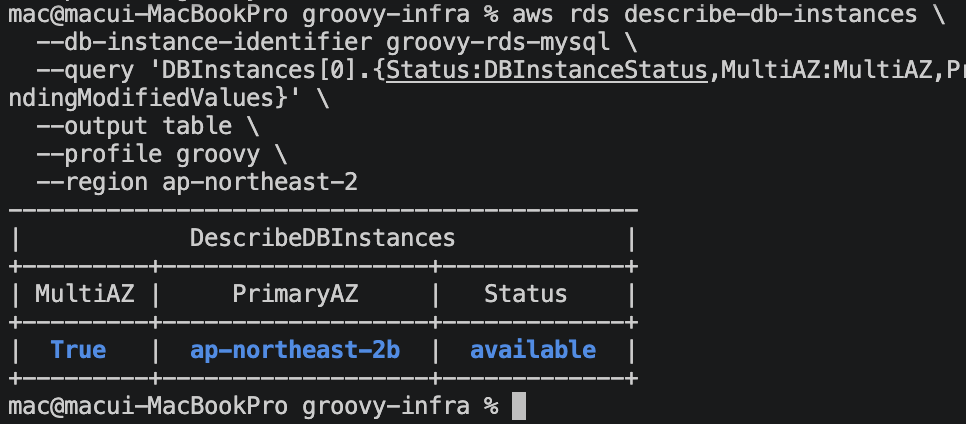
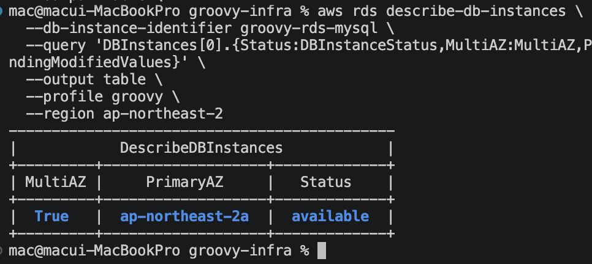
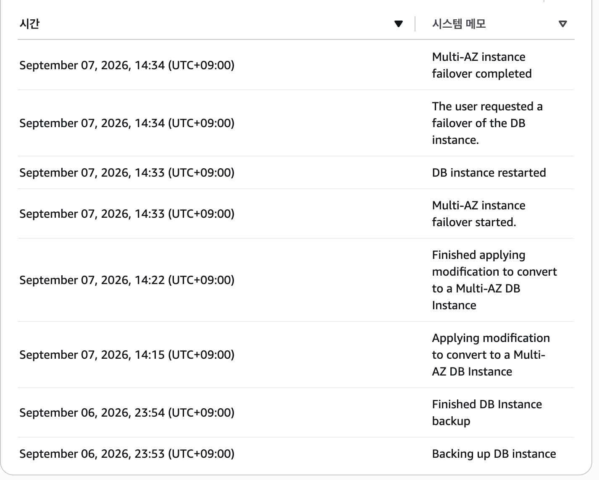
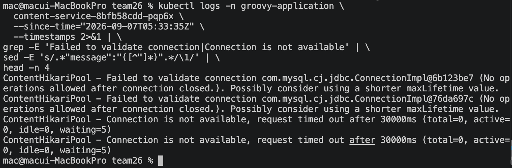
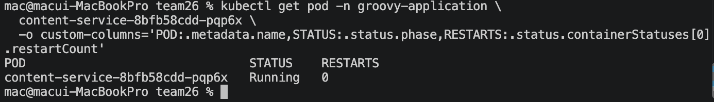
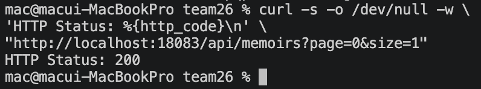

# RDS Multi-AZ Failover & DB Connection Recovery

## 1. Overview

Groovy 프로젝트는 AWS 이관 과정에서 운영 비용을 고려하여 서비스별 RDS 구성을 하나의 RDS Instance와 5개의 논리적 Database 구조로 통합했습니다.

RDS Instance 수를 줄여 비용과 관리 부담을 낮출 수 있었지만, 모든 서비스의 Database가 하나의 RDS에 의존하게 되면서 **RDS 장애의 영향 범위가 여러 서비스로 확대되는 Trade-off**가 발생했습니다.

기존 RDS는 Single-AZ로 구성되어 있었기 때문에 이러한 단일 장애 지점의 가용성을 보완하기 위해 Terraform을 통해 Multi-AZ 구조로 전환했습니다.

구성 변경에 그치지 않고 실제 장애 상황에서의 동작을 확인하기 위해 `Reboot with failover`를 실행하여 강제 Failover를 발생시켰으며, 다음 항목을 검증했습니다.

- Primary AZ가 실제로 전환되는지
- Failover 과정에서 기존 DB Connection이 어떻게 동작하는지
- 애플리케이션 Pod 재시작 없이 DB Connection이 다시 복구되는지

검증 결과 Primary AZ가 `ap-northeast-2b`에서 `ap-northeast-2a`로 전환되었고, Failover 과정에서 기존 DB Connection의 일시적인 단절이 발생했습니다.

이후 Content Service Pod의 재시작 없이 동일 Pod에서 DB 조회 API가 다시 `HTTP 200`을 반환하는 것을 확인하여, **Failover 이후 애플리케이션이 새로운 DB Connection을 통해 정상적인 요청 처리를 재개할 수 있음을 검증했습니다.**

## 2. Why Multi-AZ

최종 AWS 환경에서는 5개의 Backend Service가 하나의 RDS Instance를 공유하고, 내부 Database만 서비스별로 분리하는 구조를 사용했습니다.

~~~text
identity-service      → identity_db
study-service         → study_db
content-service       → content_db
calendar-service      → calendar_db
notification-service  → notification_db
                         ↓
                  Single RDS Instance
~~~

논리적인 데이터 소유권은 서비스별로 유지되었지만, 물리적인 Database Infrastructure는 하나의 RDS Instance에 집중되었습니다.

따라서 RDS Instance에 장애가 발생하면 특정 서비스의 Database만 영향을 받는 것이 아니라, 동일한 RDS를 사용하는 여러 Backend Service의 Database 접근에 영향을 줄 수 있었습니다.

당시 RDS는 Single-AZ로 구성되어 있었기 때문에 이러한 장애 영향 범위를 고려하면 Database Layer의 가용성을 별도로 보완할 필요가 있었습니다.

이에 따라 기존 Single-AZ RDS를 Multi-AZ로 전환하여 다른 Availability Zone에 Standby DB를 구성하고, Primary 장애 시 Failover가 가능한 구조를 적용했습니다.

~~~text
Before

Single-AZ
Primary DB
    ↓
5 Service Databases

After

Multi-AZ
Primary DB
    ↕
Standby DB
    ↓
5 Service Databases
~~~

이 단계의 목표는 단순히 `multi_az = true`를 적용하는 것이 아니라, **실제 Failover 상황에서 Database와 애플리케이션이 어떻게 동작하는지까지 검증하는 것**으로 설정했습니다.

## 3. Single-AZ → Multi-AZ

### Terraform 구성 변경

기존 RDS는 Terraform에서 Single-AZ로 구성되어 있었습니다.

~~~hcl
multi_az = false
~~~

RDS 통합 이후 Database Layer의 가용성을 보완하기 위해 다음과 같이 Multi-AZ 구성을 적용했습니다.

~~~hcl
multi_az = true
~~~

Multi-AZ 변경과 함께 RDS 삭제 과정에서의 운영 안전성을 높이기 위한 설정도 적용했습니다.

~~~hcl
deletion_protection = true
skip_final_snapshot = false
~~~

| 설정 | 적용값 | 목적 |
| --- | --- | --- |
| `multi_az` | `true` | 다른 AZ에 Standby DB를 구성하여 Failover 가능 구조 확보 |
| `deletion_protection` | `true` | 의도하지 않은 RDS Instance 삭제 방지 |
| `skip_final_snapshot` | `false` | 삭제 시 Final Snapshot을 생성하도록 구성 |

`deletion_protection`과 `skip_final_snapshot`은 Multi-AZ 자체를 위한 설정은 아니며, RDS 구성 변경 과정에서 함께 적용한 운영 안전 설정입니다.

### Terraform Plan 검증 및 적용

설정 변경 후 Terraform의 기본 검증과 Plan을 수행했습니다.

~~~bash
terraform fmt
terraform validate
AWS_PROFILE=groovy terraform plan
~~~

Plan 결과를 통해 RDS Instance를 삭제하고 새로 생성하는 Replacement가 아니라, 기존 Instance의 `multi_az` 속성을 변경하는 **In-place Update**임을 확인했습니다.

이를 확인한 뒤 변경사항을 적용했습니다.

~~~bash
AWS_PROFILE=groovy terraform apply
~~~

### Multi-AZ 적용 확인

변경 완료 후 AWS CLI를 통해 실제 RDS 상태를 확인했습니다.

확인 결과는 다음과 같았습니다.

~~~text
MultiAZ    True
PrimaryAZ  ap-northeast-2b
Status     available
~~~

이를 통해 기존 Single-AZ RDS가 Multi-AZ로 정상 전환되었고, Failover 검증 전 Primary DB가 `ap-northeast-2b`에서 정상적으로 동작하고 있음을 확인했습니다.

> 강제 Failover 전 Multi-AZ RDS의 Primary가 `ap-northeast-2b`에 위치한 것을 확인했습니다.

RDS Event에서도 Multi-AZ 전환 과정을 확인했습니다.

~~~text
14:15  Applying modification to convert to a Multi-AZ DB Instance
  ↓
14:22  Finished applying modification to convert to a Multi-AZ DB Instance
~~~

Terraform에서 요청한 변경이 실제 RDS에 반영되어 Multi-AZ DB Instance 전환이 완료된 것을 확인한 뒤, 다음 단계에서 강제 Failover 테스트를 진행했습니다.

## 4. Forced Failover Test

### 테스트 목적

Multi-AZ 구성이 정상적으로 적용된 것을 확인한 뒤, 실제 장애 상황에서 RDS Failover가 정상적으로 동작하는지 확인하기 위해 강제 Failover 테스트를 진행했습니다.

AWS RDS Console에서 `groovy-rds-mysql` Instance에 대해 **Reboot with failover**를 실행하여 실제 장애 발생을 기다리지 않고 Failover를 의도적으로 발생시켰습니다.

이 테스트에서는 다음 단계의 애플리케이션 Connection 복구 검증에 앞서, 우선 RDS 자체에서 Primary가 실제 다른 Availability Zone으로 전환되는지를 확인했습니다.

### Primary AZ 전환 확인

Failover 전 Primary DB는 `ap-northeast-2b`에서 동작하고 있었습니다.

~~~text
Before Failover

MultiAZ    True
PrimaryAZ  ap-northeast-2b
Status     available
~~~

`Reboot with failover` 실행 이후 RDS가 재부팅 상태로 전환되었고, Failover 완료 후 Primary AZ를 다시 확인했습니다.

~~~text
After Failover

PrimaryAZ  ap-northeast-2a
~~~

> 강제 Failover 완료 후 Primary AZ가 `ap-northeast-2b`에서 `ap-northeast-2a`로 변경된 것을 확인했습니다.

따라서 강제 Failover를 통해 Primary가 실제로 다음과 같이 전환된 것을 확인했습니다.

~~~text
ap-northeast-2b
        ↓
   Forced Failover
        ↓
ap-northeast-2a
~~~

### RDS Event 확인

RDS Event에서도 Failover 과정을 확인했습니다.

~~~text
14:33  Multi-AZ instance failover started
14:33  DB instance restarted
14:34  The user requested a failover of the DB instance
14:34  Multi-AZ instance failover completed
~~~

세부 Event Timestamp를 기준으로 Failover 시작부터 완료까지 **약 28.4초**가 소요되었습니다.

다만 이 수치는 **AWS RDS Event에서 관측한 Failover 처리 시간**이며, 애플리케이션의 실제 서비스 중단 시간이나 DB Connection 복구 시간을 의미하지 않습니다.

> RDS Event를 통해 Failover 시작과 완료 과정을 확인했으며, Event Timestamp 기준 처리 시간은 약 28.4초였습니다.

이를 통해 Multi-AZ 구성이 단순히 활성화된 상태에 그치지 않고, 강제 Failover 상황에서 Primary DB가 `ap-northeast-2b`에서 `ap-northeast-2a`로 실제 전환되는 것을 확인했습니다.

## 5. DB Connection Failure During Failover

RDS Failover가 진행되는 동안 애플리케이션의 기존 DB Connection이 어떻게 동작하는지 확인하기 위해 Content Service 로그를 확인했습니다.

### 기존 DB Connection 단절

Failover 시간대에 Content Service에서 다음과 같은 Connection Validation 오류가 발생했습니다.

~~~text
Failed to validate connection
(No operations allowed after connection closed.)
~~~

기존에 사용하던 MySQL Connection이 종료되면서 HikariCP가 해당 Connection을 정상적으로 사용할 수 없는 상태가 발생했습니다.

이후 새로운 DB Connection을 요청하는 과정에서도 다음 오류가 확인되었습니다.

~~~text
Connection is not available,
request timed out after 30000ms
(total=0, active=0, idle=0, waiting=5)
~~~

당시 HikariCP 상태는 다음과 같았습니다.

| 항목 | 값 |
| --- | ---: |
| Total Connection | 0 |
| Active Connection | 0 |
| Idle Connection | 0 |
| Waiting Request | 5 |
| Connection Timeout | 30,000ms |

즉 Failover 과정에서 기존 Connection이 종료된 뒤, 일시적으로 Connection Pool에서 사용할 수 있는 DB Connection이 존재하지 않았고 Connection을 기다리던 요청이 Timeout되는 현상을 확인했습니다.

> Content Service 로그에서 기존 Connection Validation 실패와 새로운 Connection 요청의 Timeout을 확인했습니다.

### 관측 결과

이번 로그를 통해 다음 흐름을 확인했습니다.

~~~text
RDS Failover
      ↓
기존 MySQL Connection 종료
      ↓
HikariCP Connection Validation 실패
      ↓
사용 가능한 Connection = 0
      ↓
DB Connection 요청 대기
      ↓
30초 Timeout 발생
~~~

여기서 확인한 것은 **Failover 과정에서 기존 DB Connection의 일시적인 단절이 실제 애플리케이션에 영향을 주었다는 것**입니다.

다음 단계에서는 이러한 Connection 오류 이후 애플리케이션 Pod를 재시작하지 않고도 DB 연결이 다시 정상적으로 복구되는지 확인했습니다.

## 6. DB Connection Recovery

Failover 과정에서 DB Connection 오류가 발생한 이후, 애플리케이션 자체의 재시작 없이 DB 연결이 다시 정상적으로 복구되는지 확인했습니다.

### Content Service Pod 재시작 여부 확인

Connection 오류가 발생했던 Content Service Pod의 상태를 확인했습니다.

~~~text
POD                                  STATUS    RESTARTS
content-service-8bfb58cdd-pqp6x      Running   0
~~~

해당 Pod의 `RESTARTS` 값은 `0`이었습니다.

따라서 Failover와 DB Connection 오류가 발생하는 동안에도 Content Service Pod 자체는 재시작되지 않았음을 확인했습니다.

> Connection 오류 이후에도 동일한 Content Service Pod가 `Running`, `RESTARTS=0` 상태를 유지했습니다.

### 동일 Pod에서 DB API 호출

이후 동일한 Content Service Pod에 직접 Port Forwarding하여 Database 조회가 필요한 API를 호출했습니다.

~~~http
GET /api/memoirs?page=0&size=1
~~~

요청 결과는 다음과 같았습니다.

~~~text
HTTP Status: 200
~~~

즉, Failover 과정에서 DB Connection 오류가 발생했던 **동일한 Pod가 재시작되지 않은 상태에서 다시 Database 데이터를 정상적으로 조회**할 수 있었습니다.

> 동일한 Content Service Pod에서 Database 조회 API가 다시 `HTTP 200`을 반환하는 것을 확인했습니다.

검증 흐름은 다음과 같습니다.

~~~text
Failover 발생
      ↓
기존 DB Connection 단절
      ↓
HikariCP Connection 사용 불가
      ↓
Content Service Pod
RESTARTS = 0
      ↓
동일 Pod에서 DB API 호출
      ↓
HTTP 200
      ↓
DB Connection 복구 확인
~~~

이를 통해 별도의 Pod 재시작 조치 없이 Failover 이후 동일한 애플리케이션 인스턴스에서 새로운 DB Connection을 통해 요청 처리가 다시 가능해졌음을 확인했습니다.

다만 이번 테스트에서는 **애플리케이션의 정확한 DB Connection 복구 시간이나 서비스 중단 시간을 별도로 측정하지 않았습니다.** 따라서 앞서 확인한 RDS Event 기준 약 28.4초를 애플리케이션 복구 시간으로 해석하지 않았습니다.

## 7. Result & Lessons Learned

### Result

이번 테스트를 통해 Single-AZ로 운영되던 RDS를 Multi-AZ 구조로 전환하고, 실제 강제 Failover 상황에서 Database와 애플리케이션의 동작을 검증했습니다.

~~~text
Single-AZ RDS
      ↓
Terraform Multi-AZ 전환
      ↓
Reboot with failover
      ↓
Primary AZ
2b → 2a
      ↓
기존 DB Connection 단절
      ↓
일시적인 Connection 사용 불가
      ↓
Content Service Pod
RESTARTS = 0
      ↓
동일 Pod DB API
HTTP 200
      ↓
DB Connection 복구 확인
~~~

단순히 `multi_az = true` 설정 여부를 확인하는 데 그치지 않고, **실제 Failover를 발생시켜 Primary 전환과 애플리케이션의 DB Connection 단절 및 복구까지 확인**했습니다.

### Lessons Learned

1. **고가용성 구성은 설정 적용만으로 검증이 끝나지 않습니다.**

   Multi-AZ가 활성화된 것을 확인하는 것과 실제 Failover 상황에서 시스템이 정상적으로 복구되는 것을 확인하는 것은 다른 문제였습니다. 강제 Failover를 통해 실제 장애 전환 경로를 검증할 필요가 있었습니다.

2. **Database Failover는 애플리케이션 Connection에도 영향을 줍니다.**

   RDS의 Primary가 전환되는 과정에서 기존 MySQL Connection이 종료되었고, HikariCP에서 일시적으로 사용 가능한 Connection이 존재하지 않는 상태가 발생했습니다.

3. **애플리케이션 재시작 여부와 DB 연결 복구를 함께 확인해야 했습니다.**

   Connection 오류 이후 Content Service Pod의 `RESTARTS = 0`을 확인하고, 동일 Pod에서 DB 조회 API가 다시 `HTTP 200`을 반환하는 것까지 검증하여 Pod 재시작 없이 요청 처리가 재개되는 것을 확인했습니다.

4. **Infrastructure 복구 시간과 Application 복구 시간은 구분해야 합니다.**

   RDS Event 기준 Failover 처리 시간은 약 28.4초였지만, 이를 애플리케이션의 실제 서비스 중단 시간이나 DB Connection 복구 시간으로 해석하지 않았습니다. 장애 검증에서는 각 Layer에서 측정한 지표의 의미를 구분하는 것이 중요하다는 점을 확인했습니다.

이번 검증을 통해 **RDS Multi-AZ 구성 자체뿐만 아니라 Failover가 실제 애플리케이션의 DB Connection에 미치는 영향과 복구 과정까지 확인**할 수 있었습니다.