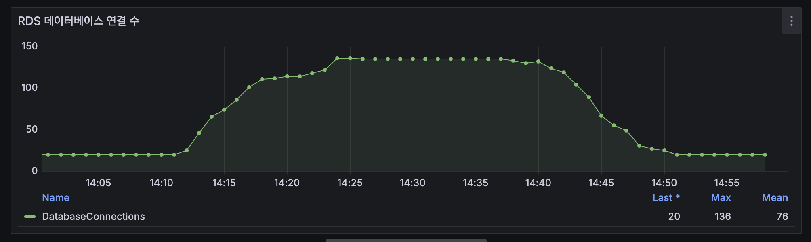
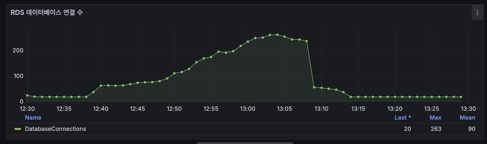
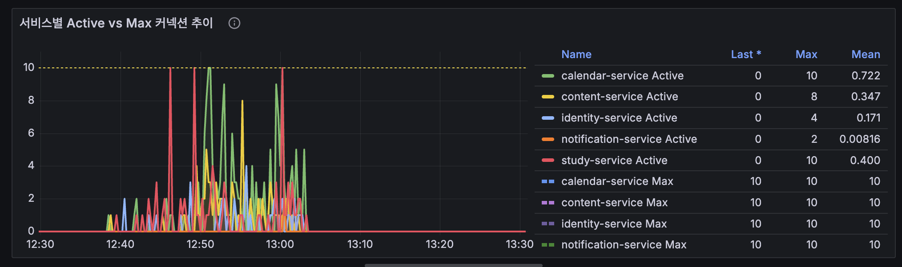
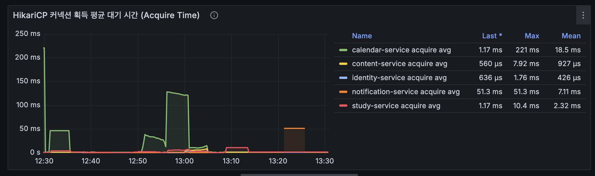
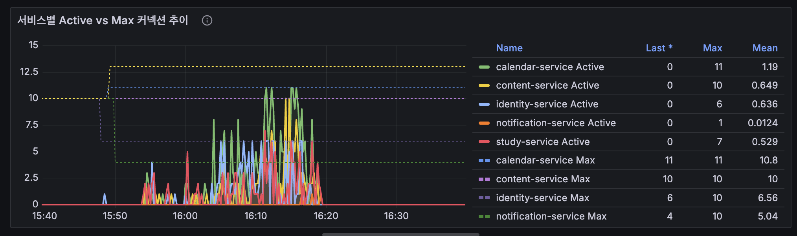

# RDS Connection Capacity Analysis & HikariCP Tuning

## 1. Overview

Groovy 프로젝트는 5개의 서비스가 하나의 AWS RDS MySQL Instance를 공유하고 있으며, 각 서비스는 논리적으로 분리된 Database와 계정을 사용합니다.

부하 테스트 과정에서 HikariCP Pending Connection이 발생했지만, 이를 단순히 애플리케이션의 Connection Pool 부족으로 판단하기 어려웠습니다. 당시 RDS 자체의 Connection 사용량 역시 상한에 근접하고 있었기 때문입니다.

따라서 이번 작업에서는 **애플리케이션의 HikariCP Pool과 RDS 자체의 Connection Capacity를 분리하여 분석**하는 것을 목표로 했습니다.

이를 위해 RDS Instance Class를 단계적으로 Scale-up하며 Connection Capacity를 확인하고, Capacity에 여유가 있는 환경에서 서비스별 실제 Connection 수요를 측정했습니다. 이후 모든 서비스에 동일하게 적용되어 있던 HikariCP Pool Size를 실제 수요에 따라 차등 조정하고, 동일한 부하 조건에서 변경 효과를 재검증했습니다.

전체 검증 과정은 다음과 같습니다.

~~~text
db.t4g.micro
max_connections = 60
        ↓
db.t4g.small
max_connections = 137
DatabaseConnections Max = 136
        ↓
RDS Connection Ceiling 근접
        ↓
db.t4g.medium
max_connections = 303
        ↓
서비스별 Connection 수요 분석
        ↓
HikariCP Pool Size 차등 조정
        ↓
동일 조건 부하 테스트
        ↓
Connection Acquire Time 개선 확인
        ↓
db.t4g.medium 최종 반영
~~~

이 과정에서 단순히 Connection Pool을 확대하거나 RDS Instance Class를 높이는 것이 아니라, **DB Capacity와 Application Connection Pool이라는 서로 다른 계층의 병목을 구분하고 실제 측정 결과를 기반으로 설정을 결정**했습니다.

## 2. RDS Connection Capacity 한계 확인

초기 Groovy AWS 환경에서는 `db.t4g.micro`를 사용하고 있었으며, 프로젝트 환경에서 실제 확인한 `max_connections`는 60이었습니다.

부하 테스트 과정에서 Connection Capacity 부족이 확인되어 먼저 `db.t4g.small`로 Scale-up했습니다.

프로젝트 환경에서 직접 확인한 Instance Class별 `max_connections`는 다음과 같습니다.

| Instance Class | max_connections |
| --- | ---: |
| `db.t4g.micro` | 60 |
| `db.t4g.small` | 137 |
| `db.t4g.medium` | 303 |

> 위 값은 Instance Class의 보편적인 고정값이 아니라, Groovy 프로젝트 환경에서 실제 MySQL 설정을 확인한 결과입니다.

### Small Scale-up 테스트

`db.t4g.small`로 변경한 뒤 동일하게 부하 테스트를 수행했습니다.

~~~text
max_connections = 137
DatabaseConnections Max = 136
~~~

최대 137개의 Connection을 허용하는 환경에서 실제 Connection이 최대 136개까지 증가하면서 **RDS Connection Capacity가 사실상 상한에 근접하는 상황**을 확인했습니다.

> `db.t4g.small` 환경에서 DatabaseConnections가 최대 136까지 증가하여, 프로젝트 환경에서 확인한 `max_connections=137`에 근접하는 것을 확인했습니다.

동시에 애플리케이션에서는 HikariCP Pending Connection도 발생했습니다.

하지만 이 상태만으로는 Pending의 원인을 단순히 HikariCP Pool Size 부족으로 판단할 수 없었습니다.

~~~text
HikariCP Pool Size 부족
        ?
        VS
        ?
RDS Connection Capacity 부족
~~~

RDS 자체가 Connection Ceiling에 근접한 상태였기 때문에, HikariCP Pool Size를 바로 확대하면 애플리케이션 측 Connection 요구량만 증가시키면서 DB의 Capacity 한계를 더욱 압박할 가능성이 있었습니다.

따라서 HikariCP를 먼저 조정하는 대신, **RDS Connection Capacity의 직접적인 영향을 완화한 환경에서 서비스별 실제 Connection 수요를 측정**하기로 했습니다.

## 3. Medium Scale-up 및 서비스별 Connection 수요 분석

Small 환경에서는 RDS Connection이 `136 / 137`까지 증가했기 때문에 RDS Capacity와 HikariCP Pool 중 어느 계층이 Connection 대기에 더 큰 영향을 주는지 분리하기 어려웠습니다.

따라서 RDS를 `db.t4g.medium`으로 Scale-up하여 Connection Capacity에 여유를 확보한 뒤, 모든 서비스의 HikariCP 설정을 동일한 Baseline으로 맞추고 다시 부하 테스트를 수행했습니다.

### Baseline 설정

모든 서비스의 HikariCP 설정을 다음과 같이 통일했습니다.

~~~yaml
maximumPoolSize: 10
minimumIdle: 2
~~~

Medium 환경에서 확인한 RDS Connection Capacity와 테스트 중 최대 Connection 사용량은 다음과 같습니다.

~~~text
max_connections          = 303
DatabaseConnections Max  = 263
~~~

Small 환경에서는 `136 / 137`까지 사용한 것과 달리, Medium에서는 RDS 자체의 Connection Ceiling에 도달하지 않았습니다.

> `db.t4g.medium` 환경에서는 테스트 중 DatabaseConnections가 최대 263까지 증가했으며, 프로젝트 환경의 `max_connections=303`에 도달하지 않았습니다.

이를 통해 **RDS Capacity의 직접적인 제약을 완화한 상태에서 서비스별 HikariCP Connection 사용 특성을 비교**할 수 있었습니다.

### 서비스별 Connection 수요

동일한 `maximumPoolSize=10`을 적용한 상태에서 서비스별 HikariCP Active/Pending Connection을 확인했습니다.

| Service | Active Max | Pending Max |
| --- | ---: | ---: |
| Calendar | 10 | 8 |
| Study | 10 | 16 |
| Content | 8 | 0 |
| Identity | 4 | 0 |
| Notification | 2 | 0 |

동일한 Pool Size를 사용하고 있었지만 실제 Connection 사용량에는 명확한 차이가 있었습니다.

> 동일한 `maximumPoolSize=10` 환경에서도 서비스별 Active Connection 사용량이 서로 다르게 나타나는 것을 확인했습니다.

Calendar와 Study는 Active Connection이 Pool 상한인 10까지 증가하면서 Pending도 발생했습니다. 반면 Content는 최대 8개의 Active Connection을 사용했고, Identity와 Notification은 각각 4개와 2개 수준에 머물렀으며 Pending도 발생하지 않았습니다.

~~~text
Calendar      → 고수요 / Pool 상한 도달 / Pending 발생
Study         → 고수요 / Pool 상한 도달 / Pending 발생
Content       → 중간 수요 / Pending 없음
Identity      → 낮은 수요 / Pending 없음
Notification  → 낮은 수요 / Pending 없음
~~~

> Baseline 환경에서 Connection Acquire Time도 함께 확인하여 Active/Pending Connection만으로 Pool Size를 판단하지 않았습니다.

다만 Pending Connection의 크기만으로 필요한 Pool Size를 결정하지 않았습니다.

Pending은 해당 시점에 Connection 반환을 기다리는 Thread 수이므로, 서비스별 Connection 수요를 판단할 때 다음 지표를 함께 확인했습니다.

- HikariCP Active Connection
- HikariCP Pending Connection
- Connection Acquire Time
- API p95
- RDS DatabaseConnections

이를 통해 **모든 서비스에 동일한 Connection Pool을 할당하는 대신 실제 서비스별 Connection 수요에 따라 Pool Size를 조정할 필요가 있다**고 판단했습니다.

## 4. 서비스별 HikariCP Pool Size 튜닝

Medium 환경의 Baseline 테스트를 통해 서비스별 Connection 수요가 서로 다르다는 것을 확인했습니다.

기존에는 모든 서비스에 동일하게 `maximumPoolSize=10`을 적용하고 있었지만, Calendar와 Study는 Pool 상한까지 Connection을 사용하면서 Pending이 발생한 반면 Identity와 Notification은 상대적으로 적은 Connection만 사용하고 있었습니다.

따라서 전체 Pool Size를 일괄적으로 확대하는 대신, **서비스별 측정 결과를 기반으로 Connection Pool을 차등 조정**했습니다.

### HikariCP 설정 변경

| Service | 기존 Max Pool | 변경 Max Pool | minimumIdle |
| --- | ---: | ---: | ---: |
| Calendar | 10 | 11 | 2 |
| Study | 10 | 13 | 2 |
| Content | 10 | 10 | 2 |
| Identity | 10 | 6 | 2 |
| Notification | 10 | 4 | 2 |

> 서비스별 Connection 수요를 기준으로 Calendar와 Study의 Pool을 확대하고, Identity와 Notification의 Pool을 축소한 설정이 적용된 것을 확인했습니다.

조정 방향은 다음과 같습니다.

~~~text
Calendar      10 → 11  ↑
Study         10 → 13  ↑
Content       10 → 10  유지
Identity      10 →  6  ↓
Notification  10 →  4  ↓
~~~

Calendar와 Study는 Baseline 테스트에서 Active Connection이 Pool 상한까지 사용되고 Pending이 발생했기 때문에 Pool을 확대했습니다.

Content는 Active Connection이 최대 8까지 증가했지만 Pending이 발생하지 않아 기존 설정을 유지했습니다.

반면 Identity와 Notification은 Active Connection 사용량이 각각 최대 4와 2 수준이었기 때문에 기존 Pool Size 10을 유지할 필요성이 낮다고 판단하여 축소했습니다.

### 일괄 확대 대신 재분배

이번 튜닝의 목적은 단순히 전체 Connection Pool의 크기를 늘리는 것이 아니었습니다.

~~~text
모든 서비스 Pool 확대
        X

서비스별 실제 수요 측정
        ↓
고수요 서비스 Pool 확대
        +
저수요 서비스 Pool 축소
        ↓
Connection Capacity 재분배
~~~

하나의 RDS Instance를 5개 서비스가 공유하는 구조에서는 각 서비스의 HikariCP Pool이 독립적으로 동작하더라도 최종적으로는 동일한 RDS Connection Capacity를 사용합니다.

따라서 특정 서비스의 Pool Size만 무분별하게 확대하면 전체 RDS Connection 사용량을 증가시켜 다른 서비스가 사용할 수 있는 Capacity까지 압박할 수 있습니다.

이에 따라 **RDS 전체 Connection Capacity를 고려하면서 서비스별 실제 수요에 맞게 Pool을 재분배하는 방향**으로 설정을 조정했습니다.

## 5. HikariCP 튜닝 효과 재검증

서비스별 HikariCP Pool Size를 조정한 뒤, 동일한 `db.t4g.medium` 환경에서 다시 부하 테스트를 수행했습니다.

### RDS Connection 사용량 비교

튜닝 전후 RDS에서 관측된 최대 Database Connection은 다음과 같습니다.

| 구분 | DatabaseConnections Max | max_connections |
| --- | ---: | ---: |
| 튜닝 전 | 263 | 303 |
| 튜닝 후 | 261 | 303 |

~~~text
Before  263 / 303
After   261 / 303
~~~

최대 Connection 사용량은 `263 → 261`로 거의 동일했습니다.

따라서 이번 결과를 **HikariCP 튜닝을 통해 RDS 전체 Connection 사용량을 크게 줄였다**고 해석하지 않았습니다.

이번 튜닝의 목적은 전체 Connection 수를 줄이는 것이 아니라, 제한된 Connection Capacity를 실제 서비스 수요에 맞게 재분배하는 것이었습니다.

### Connection Acquire Time 비교

고수요 서비스였던 Calendar와 Study의 Connection Acquire Average를 비교했습니다.

| Service | 튜닝 전 | 튜닝 후 |
| --- | ---: | ---: |
| Calendar | 18.5 ms | 4.78 ms |
| Study | 2.32 ms | 1.17 ms |

~~~text
Calendar
18.5 ms → 4.78 ms

Study
2.32 ms → 1.17 ms
~~~

RDS의 전체 Connection 사용량은 거의 동일하게 유지됐지만, Calendar와 Study에서 Connection을 획득하기 위해 기다리는 평균 시간이 감소했습니다.

즉, 단순히 전체 Connection 수를 늘리거나 줄인 것이 아니라 **서비스별 Connection 수요에 맞게 Pool Capacity를 재분배함으로써 고수요 서비스의 Connection 획득 대기를 개선**할 수 있었습니다.

### 결과 해석

이번 검증 결과는 다음과 같은 흐름으로 해석했습니다.

~~~text
RDS Capacity 확보
        ↓
서비스별 Connection 수요 측정
        ↓
동일 Pool Size의 비효율 확인
        ↓
서비스별 Pool Size 차등 조정
        ↓
동일 조건 재검증
        ↓
RDS 전체 Connection 사용량은 유사
        +
고수요 서비스 Acquire Time 감소
~~~

다만 이 결과만으로 모든 서비스의 성능이 개선됐거나 HikariCP Pending이 완전히 제거됐다고 판단하지 않았습니다.

검증에서 직접 확인한 것은 **RDS Connection 사용량이 비슷하게 유지되는 가운데 Calendar와 Study의 Connection Acquire Average가 감소했다는 점**이며, 이를 HikariCP Pool 재분배 효과를 판단하는 주요 근거로 사용했습니다.

## 6. RDS Instance Class 최종 결정

Connection Capacity 분석과 HikariCP 튜닝 결과를 바탕으로 최종 RDS Instance Class를 검토했습니다.

`db.t4g.small` 환경에서는 프로젝트에서 확인한 `max_connections=137`에 대해 실제 Database Connection이 최대 136까지 증가했습니다.

~~~text
db.t4g.small

max_connections         = 137
DatabaseConnections Max = 136
~~~

이 상태에서는 추가적인 Connection 수요가 발생할 경우 사용할 수 있는 여유가 거의 없었으며, HikariCP Pending의 원인을 애플리케이션 Pool과 RDS Capacity 관점에서 분리하여 대응하기도 어려웠습니다.

반면 `db.t4g.medium` 환경에서는 다음과 같은 결과를 확인했습니다.

~~~text
db.t4g.medium

max_connections         = 303
DatabaseConnections Max = 263
~~~

Medium 환경에서는 RDS Connection Ceiling에 도달하지 않은 상태에서 서비스별 Connection 수요를 분석할 수 있었으며, 이를 기반으로 HikariCP Pool Size를 차등 조정하고 동일 조건에서 재검증할 수 있었습니다.

따라서 최종 프로젝트 구성에서는 **Connection Capacity에 여유를 확보하면서 서비스별 HikariCP 튜닝 결과를 적용할 수 있도록 `db.t4g.medium`을 RDS Instance Class로 반영**했습니다.

~~~text
db.t4g.micro
        ↓
Connection Capacity 부족 확인

db.t4g.small
        ↓
136 / 137 사용
        ↓
Capacity 여유 부족 확인

db.t4g.medium
        ↓
263 / 303 사용
        ↓
서비스별 Connection 수요 분석
        ↓
HikariCP 차등 튜닝 및 재검증
        ↓
최종 Terraform 구성에 반영
~~~

테스트 과정에서는 AWS 비용을 줄이기 위해 RDS를 일시적으로 `db.t4g.micro`로 원상복구하기도 했습니다. 이는 테스트하지 않는 기간의 비용을 절감하기 위한 운영상의 조치였으며, 최종 Terraform 구성에서는 검증 결과를 기반으로 `db.t4g.medium`을 Desired State로 반영했습니다.

즉, Instance Class 변경은 단순한 Scale-up이 아니라 **부하 테스트를 통해 Connection Capacity 한계를 확인하고, 애플리케이션 Connection Pool과 함께 검증한 결과를 인프라 구성에 반영한 결정**이었습니다.

## 7. Result & Lessons Learned

### Result

이번 작업에서는 RDS Connection Capacity와 애플리케이션의 HikariCP Pool을 하나의 문제로 단순화하지 않고, 각각의 병목 가능성을 분리하여 검증했습니다.

주요 결과는 다음과 같습니다.

~~~text
1. RDS Connection Capacity 한계 확인
   micro : max_connections 60
   small : max_connections 137 / 실제 Max 136

2. Capacity 제약 완화를 위한 Medium 검증
   medium : max_connections 303 / 실제 Max 263

3. 서비스별 Connection 수요 차이 확인
   Calendar / Study       → 고수요
   Content                → 중간
   Identity / Notification → 저수요

4. HikariCP Pool Size 차등 조정
   Calendar      10 → 11
   Study         10 → 13
   Content       10 → 10
   Identity      10 → 6
   Notification  10 → 4

5. 동일 조건 재검증
   RDS Connection : 263 → 261

   Calendar Acquire Average : 18.5 ms → 4.78 ms
   Study Acquire Average    : 2.32 ms → 1.17 ms

6. 최종 인프라 구성
   RDS Instance Class : db.t4g.medium
~~~

이를 통해 RDS Capacity에 여유를 확보하는 동시에, 모든 서비스에 동일한 Connection Pool을 적용하는 대신 실제 Connection 수요에 맞게 HikariCP를 차등 구성했습니다.

### Lessons Learned

#### 1. Connection 문제는 Application Pool과 DB Capacity를 함께 봐야 한다

HikariCP Pending이 발생했다고 해서 곧바로 Pool Size 부족으로 판단할 수는 없었습니다.

Small 환경처럼 RDS 자체가 Connection Ceiling에 근접한 상태에서는 애플리케이션의 Pool Size를 확대하더라도 DB가 추가 Connection을 충분히 수용하지 못할 수 있습니다.

따라서 Connection 문제를 분석할 때는 HikariCP 지표뿐만 아니라 RDS의 `DatabaseConnections`와 `max_connections`를 함께 확인해야 한다는 점을 배웠습니다.

#### 2. 병목을 분리한 뒤 튜닝해야 한다

Small 환경에서는 RDS Capacity가 거의 소진되어 HikariCP Pool 자체의 수요를 명확하게 판단하기 어려웠습니다.

Medium으로 Capacity 제약을 완화한 뒤 동일한 Baseline에서 다시 측정하면서 서비스별 Connection 사용 특성을 비교할 수 있었습니다.

이를 통해 **여러 계층에 병목 가능성이 존재할 경우 하나의 설정을 바로 변경하기보다, 먼저 병목 요인을 분리할 수 있는 실험 환경을 만드는 것이 중요하다**는 점을 확인했습니다.

#### 3. 동일한 설정이 모든 서비스에 최적인 것은 아니다

5개 서비스에 동일하게 `maximumPoolSize=10`을 적용하고 있었지만 실제 Connection 수요는 서비스마다 달랐습니다.

따라서 공통 설정을 일괄적으로 확대하는 대신, 측정 결과를 기반으로 고수요 서비스에는 더 많은 Pool을 할당하고 저수요 서비스는 축소했습니다.

이를 통해 MSA 환경에서는 동일한 기본값보다 **서비스별 실제 Workload를 기반으로 Resource를 조정하는 과정이 필요하다**는 점을 확인했습니다.

#### 4. 튜닝 효과는 변경 후 동일 조건에서 다시 검증해야 한다

HikariCP 설정 변경 자체를 개선의 근거로 삼지 않고, 동일한 Medium 환경에서 다시 부하 테스트를 수행했습니다.

그 결과 RDS 전체 Connection 사용량은 `263 → 261`로 거의 동일했지만 Calendar와 Study의 Connection Acquire Average가 감소했습니다.

이를 통해 설정 변경의 효과는 추측이 아니라 **동일 조건의 재검증 결과를 통해 판단해야 한다**는 원칙을 적용할 수 있었습니다.

---

이번 검증을 통해 Groovy의 Database 운영 구조를 단순한 RDS Scale-up에서 끝내지 않고,

**Connection Capacity 확인 → 병목 분리 → 서비스별 수요 측정 → HikariCP 튜닝 → 동일 조건 재검증 → 최종 Infrastructure 반영**

까지 연결했습니다.