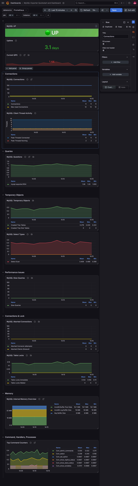
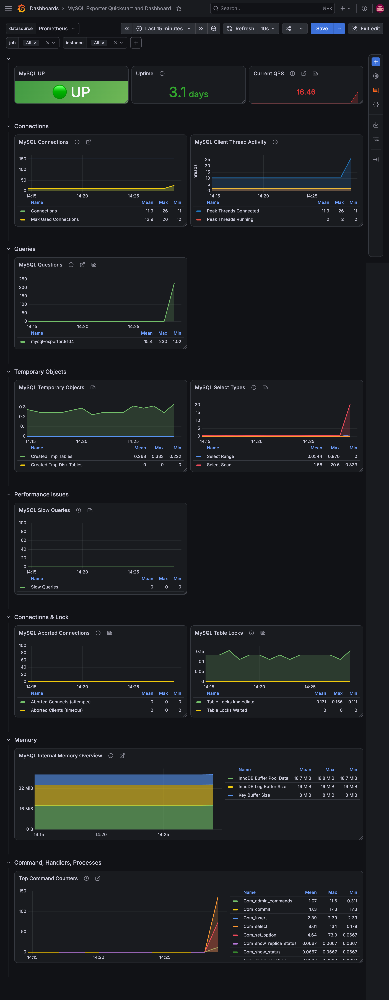
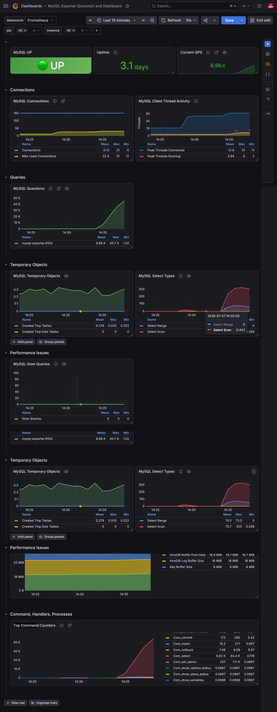
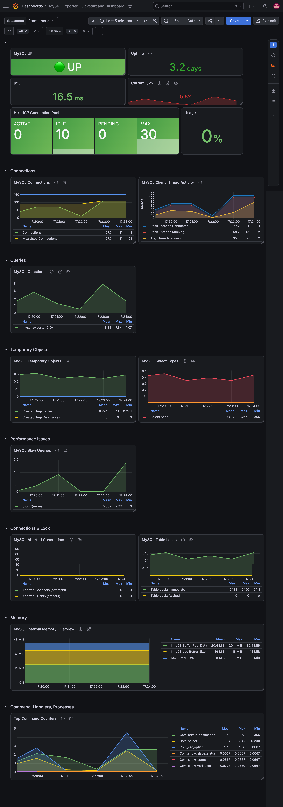
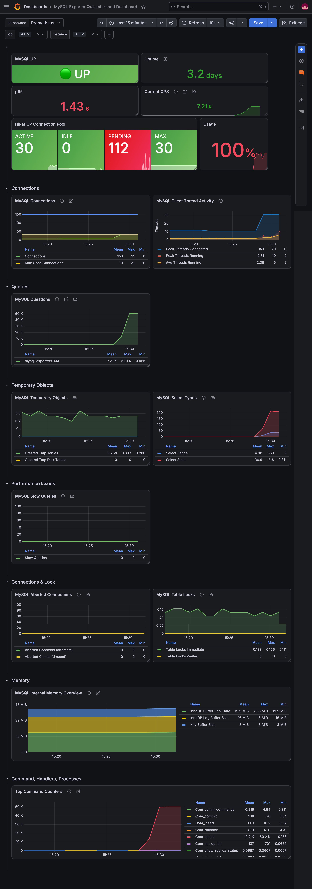

# 05. MySQL Load Test

## 실습 목표

이번 실습에서는 **Spring Boot 애플리케이션을 수정하지 않고 Python을 이용해 MySQL에 직접 부하를 발생**시켰다.

이를 통해 **MySQL 내부 메트릭이 실제로 어떻게 변화하는지**를 관찰하고, 이후 API 부하를 함께 적용하여 **데이터베이스 병목이 애플리케이션 성능에 미치는 영향**까지 확인하는 것을 목표로 하였다.

---

## 실습 환경

```text
Python
   │
   ▼
 MySQL
   │
mysqld-exporter
   │
Prometheus
   │
Grafana
```

기본 실험에서는 Python이 MySQL에 직접 연결하여 부하를 발생시켰으며, 추가 실험에서는 API 부하를 함께 적용하여 Spring Boot와 HikariCP의 동작도 함께 관찰하였다.

---

## 실습 전 상태 (Baseline)

부하를 발생시키기 전에 MySQL과 애플리케이션이 정상적으로 동작하는 기준 상태(Baseline) 를 먼저 확인하였다.

<p align="center">
  
</p>

<p align="center">
  <sub>Baseline Dashboard</sub>
</p>

### 확인 내용

- MySQL UP
- Connections 약 11
- Threads Running 2
- Slow Queries 0
- API p95 약 16ms

모든 메트릭이 안정적인 기준값을 유지하는 것을 확인하였으며, 이후 실험에서는 이 상태를 기준으로 메트릭 변화를 비교하였다.

---

## 실습 1. MySQL 연결 확인

먼저 Python의 `mysql-connector-python`을 이용하여 MySQL 연결이 정상적으로 이루어지는지 확인하였다.

### 확인 내용

- MySQL 연결
- Database 조회
- Table 조회
- users 데이터 조회

<p align="center">
  
</p>

<p align="center">
  <sub>Python을 이용한 MySQL 연결 확인</sub>
</p>

### 관찰 결과

- Connections 증가
- Threads Connected 증가
- Questions 증가

### 분석

Python에서 MySQL로 직접 Query를 실행하면서 Connections와 Questions가 증가하는 것을 확인하였다.

이를 통해 Python 환경에서도 정상적으로 MySQL 메트릭이 수집되고 있으며, 이후 부하 실험을 진행할 수 있는 상태임을 확인하였다.

---

## 실습 2. Connection Storm

동시에 다수의 Connection을 생성하여 Connection Storm 상황을 재현하였다.

<p align="center">
  
</p>

<p align="center">
  <sub>Connection Storm 발생 시 MySQL 메트릭 변화</sub>
</p>

### 관찰 결과

- Connections 증가
- Threads Connected 증가
- Questions 약 45K
- Select Scan 증가

### 분석

Connection 수는 크게 증가했지만 **Threads Running은 상대적으로 큰 변화가 없었다.**

이는 실제 Query가 오래 실행된 것이 아니라 **많은 연결이 생성되고 종료되는 상황**이었기 때문이다.

또한 Python이 MySQL에 직접 연결하므로 Spring Boot의 HikariCP는 영향을 받지 않았으며, API 응답시간 역시 거의 변화하지 않았다.

---

## 실습 3. Long Query Storm

장시간 실행되는 Query를 동시에 수행하여 MySQL 내부 Thread Activity의 변화를 확인하였다.

```sql
SELECT SLEEP(30);
```

<p align="center">
  
</p>

<p align="center">
  <sub>Long Query 실행 시 Thread Activity 변화</sub>
</p>

### 관찰 결과

- Connections 증가
- Threads Connected 증가
- Threads Running 증가
- Slow Queries 증가

### 분석

Long Query가 일정 시간 동안 종료되지 않고 유지되면서 **Threads Running과 Slow Queries가 함께 증가**하였다.

반면 Python이 직접 MySQL에 부하를 발생시킨 구조이므로 Spring Boot의 Connection Pool에는 거의 영향이 없었으며, API 응답시간도 정상 수준을 유지하였다.

---

## 실습 4. API Load + DB Load

Long Query가 실행되는 상태에서 동시에 API 부하를 발생시켜 애플리케이션과 데이터베이스가 함께 영향을 받는 상황을 재현하였다.

<p align="center">
  
</p>

<p align="center">
  <sub>DB 병목 발생 시 Hikari Connection Pool 포화</sub>
</p>

### 관찰 결과

- API p95 : 약 1.43s
- Hikari Active : 30
- Hikari Pending : 112
- Hikari Usage : 100%
- Questions 약 51K

### 분석

데이터베이스 부하가 지속되는 상황에서 API 요청이 증가하면서 **Hikari Connection Pool이 모두 사용되었다.**

새로운 요청은 즉시 Connection을 획득하지 못하고 Pending 상태에서 대기하게 되었으며, 그 결과 API p95 응답시간도 약 **1.43초**까지 증가하였다.

이를 통해 **데이터베이스 병목이 애플리케이션 응답 성능에도 직접적인 영향을 줄 수 있음**을 확인하였다.

---

## 트러블 슈팅

### Python Exit Code 139

실험 중 Python이 다음 오류와 함께 종료되는 문제가 발생하였다.

```text
Exit Code 139
Segmentation Fault
```

### 원인

`mysql-connector-python`의 C Extension 사용 과정에서 충돌이 발생한 것으로 추정된다.

### 해결

Connection 생성 시 다음 옵션을 적용하여 순수 Python Connector를 사용하였다.

```python
use_pure=True
```

이후 모든 부하 테스트를 정상적으로 수행할 수 있었다.

---

## Grafana에서 확인한 주요 메트릭

| Metric | 의미 |
|---------|------|
| API p95 | API 응답시간 |
| Current QPS | 초당 처리 요청 수 |
| Connections | 현재 MySQL 연결 수 |
| Threads Connected | 연결된 Thread 수 |
| Threads Running | 실제 실행 중인 Thread 수 |
| Questions | 처리된 Query 수 |
| Slow Queries | Slow Query 발생 횟수 |
| Hikari Active | 사용 중인 Connection 수 |
| Hikari Pending | Connection 대기 요청 수 |
| Hikari Usage | Connection Pool 사용률 |

---

## Key Insights

이번 실습을 통해 다음과 같은 내용을 확인할 수 있었다.

- Connection 수 증가와 실제 Query 실행은 서로 다른 메트릭으로 나타난다.
- Long Query는 Threads Running과 Slow Queries 증가에 직접적인 영향을 준다.
- API와 DB에 동시에 부하가 발생하면 Hikari Connection Pool이 먼저 포화될 수 있다.
- HikariCP 메트릭과 MySQL 메트릭을 함께 분석하면 애플리케이션 병목과 데이터베이스 병목을 보다 명확하게 구분할 수 있다.

---

## 실습 결론

Python을 이용하여 **Connection Storm**, **Long Query**, **API + DB Load** 시나리오를 구성하고 MySQL 병목 상황을 단계적으로 재현하였다.

실험 과정에서 Connections, Threads Running, Slow Queries, API p95, Hikari Pool 사용률 등의 메트릭 변화를 Grafana에서 직접 확인할 수 있었으며, 이를 통해 **데이터베이스의 상태 변화가 애플리케이션 성능에 어떤 영향을 미치는지** 분석할 수 있었다.

또한 Spring Boot 코드를 수정하지 않고도 다양한 데이터베이스 부하 시나리오를 재현하고, 메트릭 기반으로 원인을 분석하는 Observability 환경을 구축할 수 있음을 확인하였다.