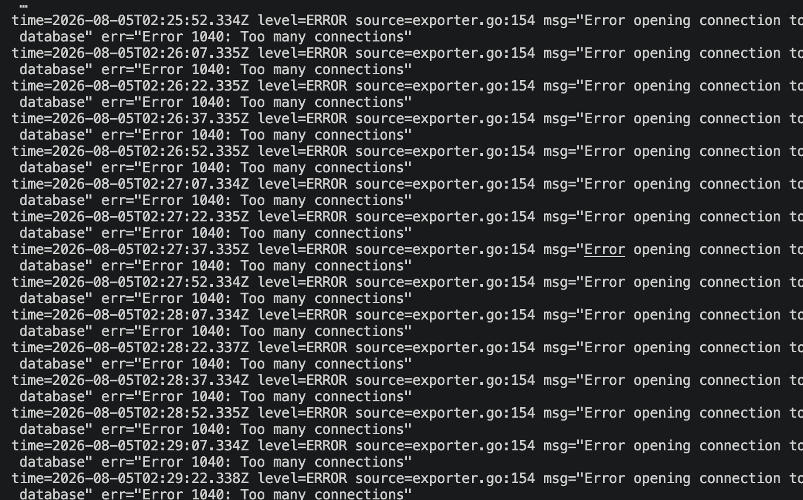

# MySQL Connection Exhaustion & Monitoring Failure

## 1. Overview

Groovy 프로젝트에서 MySQL의 Connection 한계에 도달했을 때 애플리케이션과 Monitoring 시스템이 어떻게 동작하는지 확인하기 위해 의도적으로 Connection Exhaustion 장애를 재현했습니다.

Connection 수를 단계적으로 증가시킨 결과 MySQL의 Connection 한계에 도달하면서 `1040 Too many connections` 오류가 발생했습니다.

Connection Exhaustion 자체는 예상한 결과였지만, 동시에 `mysqld-exporter`가 MySQL에 접속하지 못하면서 Prometheus Target이 DOWN 상태로 전환되고 Grafana의 MySQL Monitoring 데이터 수집까지 중단되는 예상하지 못한 현상이 발생했습니다.

따라서 단순히 Connection 한계 도달 여부를 확인하는 데서 끝내지 않고,

- Application Connection Pool 문제인지
- MySQL 자체의 Connection Exhaustion인지
- Monitoring Failure가 어떤 원인으로 발생했는지

를 각각 확인하여 장애 전파 과정을 분석했습니다.

전체 분석 흐름은 다음과 같습니다.

~~~text
Connection Storm 발생
        ↓
MySQL Connection 증가
        ↓
max_connections 도달
        ↓
1040 Too many connections
        ↓
mysqld-exporter DB Connection 실패
        ↓
Prometheus Target DOWN
        ↓
Grafana MySQL Monitoring Data Loss
~~~

---

## 2. Failure Reproduction

### 정상 상태 확인

장애 재현 전 Prometheus Target을 확인한 결과 Backend와 `mysqld-exporter` 모두 정상적으로 메트릭을 수집하고 있었습니다.

### Connection Storm 발생

MySQL에 직접 Connection을 생성하는 방식으로 Connection 수를 단계적으로 증가시켰습니다.

~~~text
20 Connections
        ↓
40 Connections
        ↓
60 Connections
        ↓
80 Connections
~~~

80개의 Connection 생성을 시도했을 때 75개까지 정상적으로 생성됐지만, 76번째부터 신규 Connection이 거부되면서 다음 오류가 발생했습니다.

~~~text
1040 (HY000): Too many connections
~~~

이를 통해 MySQL이 수용할 수 있는 Connection 한계에 도달하면 새로운 Connection 요청이 거부되는 것을 직접 확인했습니다.

---

## 3. Unexpected Monitoring Failure

Connection Exhaustion은 의도적으로 발생시킨 장애였지만, 테스트 과정에서 예상하지 못했던 현상이 함께 발생했습니다.

Grafana에서 MySQL Monitoring 상태가 DOWN으로 변경되었고, Prometheus에서도 `mysqld-exporter` Target이 정상적으로 메트릭을 수집하지 못했습니다.

즉, 테스트 대상이었던 MySQL뿐만 아니라 **MySQL을 관측하기 위한 Monitoring 경로까지 동시에 영향을 받고 있었습니다.**

따라서 다음 두 문제를 분리하여 확인했습니다.

~~~text
1. Application Connection Pool이 먼저 고갈된 것인가?

2. MySQL Connection Exhaustion으로 인해
   mysqld-exporter까지 영향을 받은 것인가?
~~~

---

## 4. Root Cause Analysis

### 4.1 HikariCP Pool 고갈 여부 확인

먼저 애플리케이션의 HikariCP Connection Pool이 먼저 고갈되면서 문제가 발생한 것인지 확인했습니다.

Grafana에서 HikariCP Pending Connection을 확인한 결과 테스트 중에도 지속적으로 `0`을 유지했습니다.

따라서 당시 관측된 장애를 **HikariCP Pool 고갈에 따른 Connection 대기 문제로 판단할 근거는 확인되지 않았습니다.**

### 4.2 MySQL Connection Ceiling 확인

반면 MySQL의 Current Connections는 Connection Storm을 진행하면서 지속적으로 증가했습니다.

최종적으로 다음 상태에 도달했습니다.

~~~text
max_connections     = 150
Current Connections = 150
~~~

Connection 수가 MySQL의 `max_connections`에 도달한 시점부터 신규 Connection 생성이 거부됐으며, 동시에 `1040 Too many connections` 오류가 발생했습니다.

Grafana에서도 MySQL Connection이 한계까지 증가하는 과정을 확인했습니다.

이를 통해 이번 장애의 직접적인 원인이 Application Connection Pool이 아니라 **MySQL 자체의 Connection Capacity 고갈**이라는 것을 확인했습니다.

### 4.3 mysqld-exporter Connection Failure 확인

다음으로 MySQL Connection Exhaustion과 Monitoring Failure의 관계를 확인했습니다.

`mysqld-exporter` 역시 MySQL의 상태 정보를 수집하기 위해 Database Connection이 필요합니다.

Connection Exhaustion 발생 시점의 `mysqld-exporter` 로그를 확인한 결과 MySQL 접속 과정에서 다음 오류가 반복적으로 발생하고 있었습니다.

~~~text
Error 1040: Too many connections
~~~

즉, MySQL의 Connection이 모두 사용된 상태에서 `mysqld-exporter` 역시 새로운 Connection을 확보하지 못했고, 그 결과 메트릭 수집에 실패한 것으로 판단했습니다.

---

## 5. Failure Propagation

분석 결과 장애는 다음과 같이 전파되었습니다.

~~~text
Connection Storm
        ↓
MySQL Current Connections 증가
        ↓
max_connections = 150 도달
        ↓
신규 Connection 거부
        ↓
1040 Too many connections
        ↓
mysqld-exporter Connection 실패
        ↓
Prometheus mysqld-exporter Target DOWN
        ↓
Grafana MySQL Monitoring Data Loss
~~~

따라서 이번 현상을 다음 두 단계로 구분했습니다.

| 구분 | 현상 |
| --- | --- |
| 1차 장애 | MySQL Connection Exhaustion |
| 2차 영향 | mysqld-exporter의 MySQL Connection 실패 및 Monitoring Data 수집 중단 |

중요한 점은 **관측 대상인 Database의 Resource 고갈이 해당 Database에 의존하는 Monitoring 구성 요소에도 영향을 줄 수 있다는 것**이었습니다.

장애 상황에서 오히려 필요한 Monitoring 데이터가 함께 손실될 수 있다는 점을 직접 확인했습니다.

---

## 6. Recovery & Limitations

테스트 당시 즉시 복구를 위해 MySQL Container를 재시작하여 기존 Connection과 Session을 초기화했습니다.

재시작 이후 다음 항목이 정상화되는 것을 확인했습니다.

~~~text
MySQL Current Connections 정상화
        ↓
mysqld-exporter 정상화
        ↓
Prometheus Metric 수집 복구
        ↓
Grafana Dashboard 정상화
~~~

다만 MySQL Container 재시작은 테스트 환경에서 장애 상태를 빠르게 초기화하기 위해 사용한 **즉시 복구 방법**이었으며, 이를 운영 환경의 일반적인 해결책으로 판단하지 않았습니다.

또한 당시에는 Connection 사용량 Alert, Connection Capacity 조정, HA 구성 등을 후속 개선 방향으로 검토했지만 이 테스트에서 해당 방안들의 효과까지 직접 검증한 것은 아니었습니다.

따라서 이번 트러블슈팅의 검증 범위는 **Connection Exhaustion 재현, 원인 분리, Monitoring Failure의 연관성 확인, 장애 상태 복구 확인**까지로 한정했습니다.

---

## 7. Result & Lessons Learned

### Result

이번 테스트를 통해 다음 흐름을 직접 확인했습니다.

~~~text
MySQL Connection Exhaustion 재현
        ↓
1040 Too many connections 확인
        ↓
HikariCP Pending = 0 확인
        ↓
Application Pool과 DB Capacity 문제 분리
        ↓
mysqld-exporter 동일 1040 오류 확인
        ↓
Monitoring Failure 원인 추적
~~~

이를 통해 이번 장애의 직접적인 원인을 MySQL Connection Exhaustion으로 판단하고, `mysqld-exporter`의 메트릭 수집 실패는 해당 장애로부터 파생된 영향으로 구분했습니다.

### Lessons Learned

#### 1. Connection 문제는 계층을 구분하여 분석해야 한다

Connection 관련 장애가 발생했다고 해서 모든 문제를 Application Connection Pool 부족으로 판단할 수는 없습니다.

HikariCP Pending과 MySQL Current Connections를 함께 확인함으로써 Application Pool과 Database Capacity라는 서로 다른 계층을 구분하여 원인을 분석할 수 있었습니다.

#### 2. Monitoring 시스템도 장애의 영향을 받을 수 있다

Monitoring 시스템은 장애를 관측하기 위한 구성 요소이지만, `mysqld-exporter`처럼 관측 대상에 직접 의존하는 구조에서는 대상 시스템의 Resource 고갈이 Monitoring 경로까지 영향을 줄 수 있습니다.

따라서 장애 대응 시 서비스 상태뿐만 아니라 **관측 경로 자체가 정상적으로 동작하고 있는지도 함께 확인해야 한다**는 점을 확인했습니다.

#### 3. 예상한 장애보다 예상하지 못한 2차 영향을 추적하는 것이 중요하다

`1040 Too many connections` 자체는 의도적으로 Connection Exhaustion을 발생시킨 결과였습니다.

이번 테스트에서 더 중요한 발견은 그 과정에서 예상하지 못했던 `mysqld-exporter` DOWN이 함께 발생했다는 점이었습니다.

예상하지 못한 현상을 별개의 장애로 처리하는 대신 원래 장애와의 연관성을 추적하면서 **원인과 2차 영향을 구분하는 방식으로 Root Cause를 분석**했습니다.

---

이 경험은 이후 MSA와 AWS RDS 환경에서 Connection 문제를 다시 다룰 때, 단순히 Pool Size를 확대하는 대신 **Application Connection Pool과 Database Connection Capacity를 함께 측정하고 병목을 분리하여 분석하는 접근**으로 이어졌습니다.

해당 과정은 [`RDS Connection Capacity Analysis & HikariCP Tuning`](../infrastructure/04_RDS_Connection_Capacity.md)에서 이어집니다.