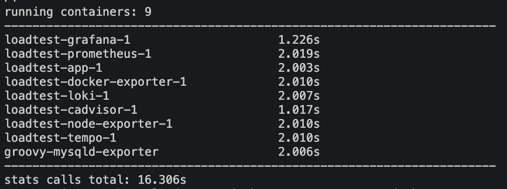
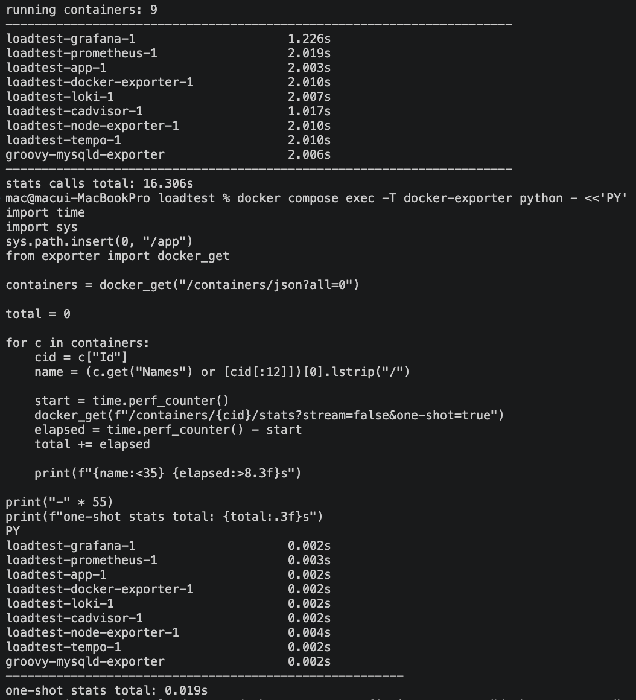
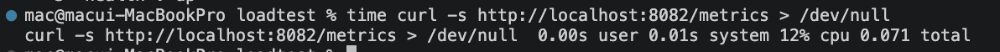
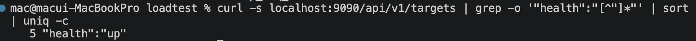

# TS-002. Docker Exporter 응답 지연으로 인한 Prometheus Target DOWN

## 1. 문제 상황

부하 테스트 및 Observability 환경을 구성한 뒤 Prometheus Target 상태를 확인하였다.

확인 결과 `docker-exporter`가 `DOWN` 상태였으며 다음 오류가 발생하고 있었다.

```text
job: docker-exporter
scrapeUrl: http://docker-exporter:8080/metrics
lastError: context deadline exceeded
health: down
scrapeInterval: 15s
scrapeTimeout: 10s
```

즉, Prometheus가 Docker Exporter의 `/metrics` 엔드포인트에 접근하고 있었지만 제한 시간 내 응답을 받지 못하고 있었다.

---

## 2. 원인 분석

Docker Exporter 자체의 응답시간을 확인하기 위해 `/metrics` 요청에 걸리는 시간을 직접 측정하였다.

```bash
time curl -s http://localhost:8082/metrics > /dev/null
```

측정 결과 약 **17.2초**가 소요되었다.


당시 Prometheus의 설정은 다음과 같았다.

```yaml
scrape_interval: 15s
scrape_timeout: 10s
```

Docker Exporter가 메트릭을 생성하는 데 약 17.2초가 걸리는 반면 Prometheus는 10초까지만 응답을 기다리고 있었다.

따라서 Docker Exporter가 응답을 완료하기 전에 Prometheus의 `scrape_timeout`이 먼저 발생하면서 다음 오류와 함께 Target이 `DOWN` 상태로 전환된 것으로 판단하였다.

```text
context deadline exceeded
```

Docker Exporter 로그에서 반복적으로 확인된 `BrokenPipeError` 역시 Prometheus가 timeout으로 연결을 먼저 종료한 뒤 Exporter가 응답을 쓰려고 하면서 발생한 현상으로 판단하였다.

---

## 3. 1차 조치 - Prometheus Scrape 설정 조정

### 3.1 대응 방향

우선 Prometheus의 메트릭 수집을 정상화하기 위해 Docker Exporter의 실제 응답시간보다 충분한 `scrape_timeout`을 확보하는 방향으로 설정을 변경하였다.

Docker Exporter의 응답시간이 약 17.2초였기 때문에 기존 10초의 timeout을 25초로 증가시키고자 하였다.

### 3.2 첫 번째 설정 변경 실패

그러나 `scrape_timeout`만 25초로 증가시키는 과정에서 Prometheus가 정상적으로 시작되지 않았으며 다음 오류가 발생하였다.

```text
Error loading config
scrape timeout greater than scrape interval
```

당시 `scrape_interval`은 15초였기 때문에 timeout을 25초로 설정할 수 없었다.

Prometheus에서는 `scrape_timeout`이 `scrape_interval`보다 길어질 수 없으므로 timeout뿐만 아니라 interval도 함께 조정해야 했다.

### 3.3 Scrape Interval / Timeout 재조정

Docker Exporter의 약 17.2초 응답시간을 고려하여 해당 Job의 설정을 다음과 같이 변경하였다.

```yaml
- job_name: 'docker-exporter'
  scrape_interval: 30s
  scrape_timeout: 25s
  static_configs:
    - targets: ['docker-exporter:8080']
```


이를 통해 Docker Exporter가 응답을 완료할 수 있는 시간을 확보하면서,

```text
scrape_timeout < scrape_interval
```

조건도 만족하도록 구성하였다.

### 3.4 1차 조치 재검증

설정 수정 후 Prometheus Target 상태를 다시 확인하였다.

```bash
curl -s localhost:9090/api/v1/targets \
| grep -o '"health":"[^"]*"' \
| sort | uniq -c
```

결과:

```text
5 "health":"up"
```


전체 5개 Target이 모두 `UP` 상태로 정상화된 것을 확인하였다.

따라서 Prometheus의 메트릭 수집 실패는 우선 해결할 수 있었다.

---

## 4. 1차 조치의 한계

Prometheus의 `scrape_interval`과 `scrape_timeout`을 조정하면서 Docker Exporter Target은 다시 `UP` 상태로 정상화되었다.

하지만 이 조치는 **Prometheus가 Docker Exporter의 응답을 더 오래 기다릴 수 있도록 변경한 것**으로, Docker Exporter의 응답시간 자체가 개선된 것은 아니었다.

```text
Docker Exporter /metrics
약 17.2초
        │
        ▼
Prometheus scrape_timeout 10s
        │
        ▼
Timeout
        │
        ▼
Target DOWN

        ↓ 1차 조치

scrape_interval 30s
scrape_timeout 25s
        │
        ▼
17.2초 응답 수집 가능
        │
        ▼
Target UP
```

따라서 1차 조치는 **모니터링 수집을 우선 정상화하기 위한 대응**으로 판단하였다.

이후 Prometheus의 대기시간을 늘리는 방식이 아니라 Docker Exporter의 `/metrics` 응답시간 자체를 줄이기 위한 추가 분석을 진행하였다.

---

## 5. 2차 조치 - Docker Exporter 응답시간 최적화

### 5.1 Docker Stats 수집 구간 측정

Docker Exporter가 `/metrics` 응답을 생성하는 과정에서 어느 구간에 시간이 소요되는지 확인하였다.

Exporter는 실행 중인 컨테이너 목록을 조회한 뒤 각 컨테이너에 대해 Docker Stats API를 호출하고 있었다.

기존 호출 방식은 다음과 같았다.

```python
stats = docker_get(
    f"/containers/{quote(container_id, safe='')}/stats?stream=false"
)
```

각 컨테이너의 Stats API 호출 시간을 개별적으로 측정하였다.

측정 결과는 다음과 같았다.

```text
running containers: 9

loadtest-grafana-1                     1.226s
loadtest-prometheus-1                  2.019s
loadtest-app-1                         2.003s
loadtest-docker-exporter-1             2.010s
loadtest-loki-1                        2.007s
loadtest-cadvisor-1                    1.017s
loadtest-node-exporter-1               2.010s
loadtest-tempo-1                       2.010s
groovy-mysqld-exporter                 2.006s

stats calls total: 16.306s
```



특정 컨테이너 하나에서 지연이 발생한 것이 아니라 대부분의 컨테이너에서 약 1~2초의 응답시간이 반복적으로 발생하고 있었다.

또한 9개 컨테이너의 Stats API 호출에 소요된 전체 시간은 약 **16.306초**였다.

기존 `/metrics` 전체 응답시간이 약 17.2초였던 점을 고려하면, **Docker Stats API를 순차적으로 호출하는 과정이 전체 응답 지연의 대부분을 차지하고 있음**을 확인할 수 있었다.

---

### 5.2 `one-shot=true` 비교 실험

Docker Stats API 호출 과정에서 발생하는 대기시간을 줄일 수 있는지 확인하기 위해 기존 요청에 `one-shot=true` 옵션을 추가하여 동일한 방식으로 다시 측정하였다.

기존:

```text
/stats?stream=false
```

비교:

```text
/stats?stream=false&one-shot=true
```

동일한 9개 컨테이너를 대상으로 측정한 결과는 다음과 같았다.

```text
loadtest-grafana-1                     0.002s
loadtest-prometheus-1                  0.003s
loadtest-app-1                         0.002s
loadtest-docker-exporter-1             0.002s
loadtest-loki-1                        0.002s
loadtest-cadvisor-1                    0.002s
loadtest-node-exporter-1               0.004s
loadtest-tempo-1                       0.002s
groovy-mysqld-exporter                 0.002s

one-shot stats total: 0.019s
```



Stats 수집에 걸리는 전체 시간이 다음과 같이 감소하였다.

```text
Before: 16.306s
After :  0.019s
```

이를 통해 Docker Exporter의 긴 응답시간이 컨테이너별 Stats API 호출 과정에서 발생하고 있었으며, `one-shot=true`를 적용할 경우 해당 대기시간을 크게 줄일 수 있음을 확인하였다.

---

### 5.3 Docker Exporter 코드 수정

비교 실험 결과를 바탕으로 Docker Exporter의 Stats API 호출 방식을 변경하였다.

기존 코드:

```python
stats = docker_get(
    f"/containers/{quote(container_id, safe='')}/stats?stream=false"
)
```

변경 코드:

```python
stats = docker_get(
    f"/containers/{quote(container_id, safe='')}/stats?stream=false&one-shot=true"
)
```

변경 후 Docker Exporter 이미지를 다시 Build하여 컨테이너를 재생성하였다.

```bash
docker compose up -d --build docker-exporter
```

---

## 6. 2차 조치 재검증

### 6.1 `/metrics` 응답시간 재측정

수정된 Docker Exporter를 대상으로 처음과 동일한 명령을 사용하여 `/metrics` 응답시간을 다시 측정하였다.

```bash
time curl -s http://localhost:8082/metrics > /dev/null
```

측정 결과 약 **0.071초**가 소요되었다.



개선 전후를 비교하면 다음과 같다.

```text
Docker Stats 수집
Before: 16.306s
After :  0.019s

Docker Exporter /metrics
Before: 약 17.2s
After : 약 0.071s
```

Docker Exporter의 실제 `/metrics` 응답시간이 약 17.2초에서 0.071초로 크게 감소한 것을 확인하였다.

---

### 6.2 Prometheus Scrape 설정 원복

Docker Exporter의 응답시간 자체가 개선되었으므로 1차 조치에서 임시로 증가시켰던 Prometheus 설정도 기존 값으로 복구하였다.

```yaml
- job_name: 'docker-exporter'
  scrape_interval: 15s
  scrape_timeout: 10s
  static_configs:
    - targets: ['docker-exporter:8080']
```

즉,

```text
1차 조치
scrape_interval: 30s
scrape_timeout: 25s

        ↓

2차 개선 후

scrape_interval: 15s
scrape_timeout: 10s
```

로 복구하였다.

---

### 6.3 최종 Target 상태 확인

Prometheus 설정을 기존 값으로 복구한 뒤 전체 Target 상태를 다시 확인하였다.

```bash
curl -s localhost:9090/api/v1/targets \
| grep -o '"health":"[^"]*"' \
| sort | uniq -c
```

결과:

```text
5 "health":"up"
```



Docker Exporter의 응답시간을 개선한 뒤에는 기존 `scrape_interval: 15s`, `scrape_timeout: 10s` 설정에서도 전체 5개 Target이 모두 `UP` 상태로 유지되는 것을 확인하였다.

---

## 7. 최종 장애 및 개선 흐름

```text
docker-exporter Target DOWN
        │
        ▼
context deadline exceeded
        │
        ▼
/metrics 직접 측정
        │
        ▼
약 17.2초
        │
        ▼
Prometheus scrape_timeout = 10s
        │
        ▼
응답시간 > timeout
        │
        ▼
[1차 조치]
timeout 증가 시도
        │
        ▼
scrape timeout greater than scrape interval
        │
        ▼
interval 30s / timeout 25s
        │
        ▼
Targets 5/5 UP
        │
        ▼
모니터링 수집 우선 정상화
        │
        ▼
그러나 /metrics는 여전히 약 17.2초
        │
        ▼
[2차 원인 분석]
컨테이너별 Docker Stats 호출시간 측정
        │
        ▼
9개 순차 호출 = 16.306초
        │
        ▼
one-shot=true 비교 실험
        │
        ▼
Stats 수집 = 0.019초
        │
        ▼
Exporter 코드에 one-shot=true 적용
        │
        ▼
/metrics
17.2초 → 0.071초
        │
        ▼
Prometheus 설정 원복
interval 15s / timeout 10s
        │
        ▼
Targets 5/5 UP
```

---

## 8. 배운 점

이번 문제를 통해 Prometheus Target이 `DOWN`이라고 해서 반드시 Exporter 프로세스 자체가 중단된 것은 아니라는 점을 확인하였다.

Exporter가 실행 중이더라도 `/metrics` 응답시간이 Prometheus의 `scrape_timeout`을 초과하면 수집 실패로 인해 Target이 `DOWN` 상태가 될 수 있다.

처음에는 `scrape_timeout`과 `scrape_interval`을 늘려 Prometheus가 Exporter의 응답을 기다릴 수 있도록 조정하였다. 이를 통해 모니터링 수집은 빠르게 정상화할 수 있었지만, Exporter의 약 17.2초 응답 지연 자체가 해결된 것은 아니었다.

따라서 정상화 이후에도 응답시간을 세부 구간으로 나누어 측정하였다.

```text
/metrics 전체 응답시간
        ↓
Docker Stats 호출시간 측정
        ↓
9개 컨테이너 순차 호출 약 16.306초
        ↓
병목 구간 특정
        ↓
one-shot=true 비교 실험
        ↓
Stats 수집 약 0.019초
        ↓
실제 코드 적용
        ↓
/metrics 약 0.071초
```

이를 통해 **서비스를 우선 정상화하는 조치와 지연의 원인을 제거하는 개선은 서로 구분해서 접근할 필요가 있다**는 점을 확인하였다.

또한 장애 분석 과정에서 단순히 설정값을 변경하는 데 그치지 않고, 전체 응답시간을 구성하는 세부 작업의 시간을 직접 측정하면서 병목 지점을 좁혀가는 방식이 효과적이었다.

최종적으로 Docker Exporter의 응답시간을 개선한 뒤 Prometheus 설정을 기존 `15s / 10s`로 복구하고도 전체 Target이 정상적으로 유지되는 것을 확인하면서 개선 효과를 재검증하였다.