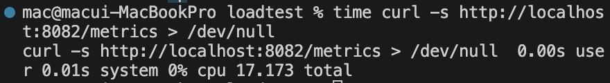
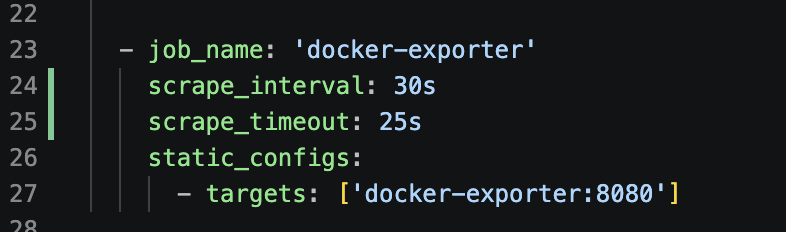
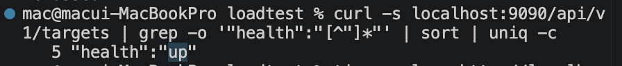

# TS-002. Docker Exporter 응답 지연으로 인한 Prometheus Target DOWN

## 1. 문제 상황

부하 테스트 및 Observability 환경을 구성한 뒤 Prometheus Target 상태를 확인하였다.

```bash
curl -s http://localhost:9090/api/v1/targets \
| grep -o '"health":"[^"]*"' \
| sort | uniq -c
```

확인 결과 전체 5개 Target 중 1개가 `DOWN` 상태였다.

```text
1 "health":"down"
4 "health":"up"
```

DOWN 상태인 Target을 특정하기 위해 상세 정보를 확인하였다.

```bash
curl -s http://localhost:9090/api/v1/targets \
| python3 -m json.tool \
| grep -B 8 -A 8 '"health": "down"'
```

확인 결과 `docker-exporter`가 DOWN 상태였으며 다음 오류가 발생하고 있었다.

```text
job: docker-exporter
scrapeUrl: http://docker-exporter:8080/metrics
lastError: context deadline exceeded
health: down
scrapeInterval: 15s
scrapeTimeout: 10s
```

즉, Prometheus가 Docker Exporter의 `/metrics` 엔드포인트에 접근하고 있었지만 제한 시간 내 응답을 받지 못하고 있었다.

---

## 2. 원인 분석

Docker Exporter 자체의 응답시간을 확인하기 위해 `/metrics` 요청에 걸리는 시간을 직접 측정하였다.

```bash
time curl -s http://localhost:8082/metrics > /dev/null
```

측정 결과 약 **17.2초**가 소요되었다.



당시 Prometheus의 기본 설정은 다음과 같았다.

```yaml
scrape_interval: 15s
scrape_timeout: 10s
```

Docker Exporter가 메트릭을 생성하는 데 약 17.2초가 걸리는 반면 Prometheus는 10초까지만 응답을 기다리고 있었다.

따라서 Docker Exporter가 응답을 완료하기 전에 Prometheus의 scrape timeout이 먼저 발생하면서 다음 오류와 함께 Target이 `DOWN` 상태로 전환된 것으로 판단하였다.

```text
context deadline exceeded
```

Docker Exporter 로그에서 반복적으로 확인된 `BrokenPipeError` 역시 Prometheus가 timeout으로 연결을 먼저 종료한 뒤 Exporter가 응답을 쓰려고 하면서 발생한 현상으로 판단하였다.

---

## 3. 1차 조치 및 추가 문제 발생

Exporter의 응답시간보다 충분히 긴 시간을 확보하기 위해 `scrape_timeout`을 증가시키는 방향으로 설정을 변경하였다.

그러나 timeout만 증가시키는 과정에서 다음 오류가 발생하며 Prometheus가 정상적으로 시작되지 않았다.

```text
Error loading config
scrape timeout greater than scrape interval
```

Prometheus에서는 `scrape_timeout`을 `scrape_interval`보다 크게 설정할 수 없기 때문에 timeout뿐만 아니라 interval도 함께 조정해야 했다.

---

## 4. 최종 조치

Docker Exporter의 실제 응답시간이 약 17.2초임을 고려하여 해당 Job의 scrape 설정을 다음과 같이 변경하였다.

```yaml
- job_name: 'docker-exporter'
  scrape_interval: 30s
  scrape_timeout: 25s
  static_configs:
    - targets: ['docker-exporter:8080']
```



이를 통해 약 17.2초가 소요되는 Docker Exporter가 응답을 완료할 수 있도록 timeout을 확보하면서, `scrape_timeout < scrape_interval` 조건도 만족하도록 구성하였다.

---

## 5. 재검증

설정 수정 후 Prometheus Target 상태를 다시 확인하였다.

```bash
curl -s localhost:9090/api/v1/targets \
| grep -o '"health":"[^"]*"' \
| sort | uniq -c
```

결과:

```text
5 "health":"up"
```



전체 5개 Target이 모두 `UP` 상태로 정상화된 것을 확인하였다.

---

## 6. 장애 흐름 정리

```text
Docker Exporter /metrics 응답 지연
        │
        │ 약 17.2초
        ▼
Prometheus scrape_timeout = 10s
        │
        ▼
응답 완료 전 Timeout
        │
        ▼
context deadline exceeded
        │
        ▼
docker-exporter Target DOWN
        │
        ▼
응답시간 직접 측정
        │
        ▼
scrape 설정 조정
interval 30s / timeout 25s
        │
        ▼
Prometheus Targets 5/5 UP
```

---

## 7. 배운 점

이번 문제를 통해 Prometheus Target이 `DOWN`이라고 해서 반드시 Exporter 프로세스 자체가 중단된 것은 아니라는 점을 확인하였다.

Exporter가 실행 중이더라도 `/metrics` 응답시간이 Prometheus의 `scrape_timeout`을 초과하면 수집 실패로 인해 Target이 `DOWN` 상태가 될 수 있다.

또한 단순히 timeout 값만 증가시키는 것이 아니라 `scrape_timeout`과 `scrape_interval`의 관계를 함께 고려해야 한다는 점을 확인하였다.

장애 분석 과정에서는 다음 순서로 원인을 좁혀가는 것이 효과적이었다.

```text
Target 상태 확인
→ lastError 확인
→ Exporter 로그 확인
→ /metrics 직접 호출
→ 실제 응답시간 측정
→ Prometheus scrape 설정 확인
→ 설정 수정
→ Target 상태 재검증
```

이를 통해 모니터링 시스템 자체에도 응답시간과 수집 주기에 대한 적절한 설정이 필요하며, 모니터링 구성요소 역시 장애 분석의 대상이 되어야 한다는 점을 학습하였다.
